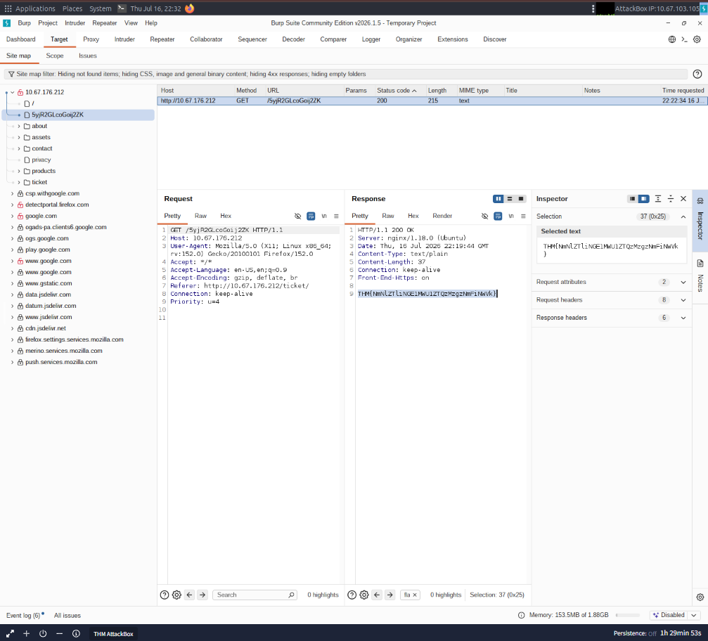

## Features of Burp Suite:

Although Burp Suite Community offers a more limited feature set compared to the Professional edition, it still provides an impressive array of tools that are highly valuable for web application testing. Let's explore some of the key features:

1. Proxy: The Burp Proxy is the most renowned aspect of Burp Suite. It enables interception and modification of requests and responses while interacting with web applications.
2. Repeater: Another well-known feature. Repeater allows for capturing, modifying, and resending the same request multiple times. This functionality is particularly useful when crafting payloads through trial and error (e.g., in SQLi - Structured Query Language Injection) or testing the functionality of an endpoint for vulnerabilities.
3. Intruder: Despite rate limitations in Burp Suite Community, Intruder allows for spraying endpoints with requests. It is commonly utilized for brute-force attacks or fuzzing endpoints.
4. Decoder: Decoder offers a valuable service for data transformation. It can decode captured information or encode payloads before sending them to the target. While alternative services exist for this purpose, leveraging Decoder within Burp Suite can be highly efficient.
5. Comparer: As the name suggests, Comparer enables the comparison of two pieces of data at either the word or byte level. While not exclusive to Burp Suite, the ability to send potentially large data segments directly to a comparison tool with a single keyboard shortcut significantly accelerates the process.
6. Sequencer: Sequencer is typically employed when assessing the randomness of tokens, such as session cookie values or other supposedly randomly generated data. If the algorithm used for generating these values lacks secure randomness, it can expose avenues for devastating attacks.

The Burp Dashboard is divided into four quadrants, as labelled in counter-clockwise order starting from the top left:

1. Tasks: The Tasks menu allows you to define background tasks that Burp Suite will perform while you use the application. In Burp Suite Community, the default “Live Passive Crawl” task, which automatically logs the pages visited, is sufficient for our purposes in this module. Burp Suite Professional offers additional features like on-demand scans.

2. Event log: The Event log provides information about the actions performed by Burp Suite, such as starting the proxy, as well as details about connections made through Burp.

3. Issue Activity: This section is specific to Burp Suite Professional. It displays the vulnerabilities identified by the automated scanner, ranked by severity and filterable based on the certainty of the vulnerability.

4. Advisory: The Advisory section provides more detailed information about the identified vulnerabilities, including references and suggested remediations. This information can be exported into a report. In Burp Suite Community, this section may not show any vulnerabilities.

## Connecting through Foxy Proxy:

1. Install FoxyProxy: Download and install the FoxyProxy Basic extension.
2. Access FoxyProxy Options: Once installed, a button will appear at the top right of the Firefox browser. Click on the FoxyProxy button to access the FoxyProxy options pop-up
3. Create Burp Proxy Configuration: In the FoxyProxy options pop-up, click the Options button. This will open a new browser tab with the FoxyProxy configurations. Click the Add button to create a new proxy configuration.
4. Add Proxy Details: On the "Add Proxy" page, fill in the following values:
   ->Title: Burp (or any preferred name)
   ->Proxy IP: 127.0.0.1
   ->Port: 8080
5. Save Configuration: Click Save to save the Burp Proxy configuration.
6. Activate Proxy Configuration: Click on the FoxyProxy icon at the top-right of the Firefox browser and select the Burp configuration. This will redirect your browser traffic through 127.0.0.1:8080. Note that Burp Suite must be running for your browser to make requests when this configuration is activated.
7. Enable Proxy Intercept in Burp Suite: Switch to Burp Suite and ensure that Intercept is turned on in the Proxy tab.
8. Test the Proxy: Open Firefox and try accessing a website, such as the homepage for http://10.67.176.212/. Your browser will hang, and the proxy will populate with the HTTP request. Congratulations, you have successfully intercepted your first request!

Certificate changes that needs to be done to avoid http certificate warnings

1. Start Burp Suite.
2. With the browser using Burp proxy, navigate to: http://burpsuite or http://127.0.0.1:8080
3. Download the CA Certificate.
4. Import it into the browser's certificate store:
   Firefox:
   Settings → Privacy & Security → Certificates → View Certificates → Authorities → Import
   Trust the certificate for website identification.
   Chrome/Edge:
   Import into the operating system's Trusted Root Certification Authorities store.

## Site Map and Issue Definations

The Target tab in Burp Suite provides more than just control over the scope of our testing. It consists of three sub-tabs:

Site map: This sub-tab allows us to map out the web applications we are targeting in a tree structure. Every page that we visit while the proxy is active will be displayed on the site map. This feature enables us to automatically generate a site map by simply browsing the web application. In Burp Suite Professional, we can also use the site map to perform automated crawling of the target, exploring links between pages and mapping out as much of the site as possible. Even with Burp Suite Community, we can still utilize the site map to accumulate data during our initial enumeration steps. It is particularly useful for mapping out APIs, as any API endpoints accessed by the web application will be captured in the site map.

Issue definitions: Although Burp Community does not include the full vulnerability scanning functionality available in Burp Suite Professional, we still have access to a list of all the vulnerabilities that the scanner looks for. The Issue definitions section provides an extensive list of web vulnerabilities, complete with descriptions and references. This resource can be valuable for referencing vulnerabilities in reports or assisting in describing a particular vulnerability that may have been identified during manual testing.

Scope settings: This setting allows us to control the target scope in Burp Suite. It enables us to include or exclude specific domains/IPs to define the scope of our testing. By managing the scope, we can focus on the web applications we are specifically targeting and avoid capturing unnecessary traffic.

### Quesition: 

What is the flag you receive after visiting the unusual endpoint? --> THM{NmNlZTliNGE1MWU1ZTQzMzgzNmFiNWVk}

Take a look around the site on http://10.67.176.212/ — we will be using this a lot throughout the module. Visit every other page that is linked on the homepage, then check your sitemap — one endpoint should stand out as being very unusual!

### The Burpsuite Browser

In addition to modifying our regular web browser to work with the proxy, Burp Suite also includes a built-in Chromium browser that is pre-configured to use the proxy without any of the modifications we just had to do.
To start the Burp Browser, click the Open Browser button in the proxy tab. A Chromium window will pop up, and any requests made in this browser will go through the proxy.

However, if you are running Burp Suite on Linux as the root user (as is the case with the AttackBox), you may encounter an error preventing the Burp Browser from starting due to the inability to create a sandbox environment.

There are two simple solutions to this:

1. Smart option: Create a new user and run Burp Suite under a low-privilege account to allow the Burp Browser to run without issues.
2. Easy option: Go to Settings -> Tools -> Burp's browser and check the Allow Burp's browser to run without a sandbox option. Enabling this option will allow the browser to start without a sandbox. However, please be aware that this option is disabled by default for security reasons. If you choose to enable it, exercise caution, as compromising the browser could grant an attacker access to your entire machine. In the training environment of the AttackBox, this is unlikely to be a significant issue, but use it responsibly.

### Scoping and Targetting

Capturing and logging all of the traffic can quickly become overwhelming and inconvenient, especially when we only want to focus on specific web applications. This is where scoping comes in.

By setting a scope for the project, we can define what gets proxied and logged in Burp Suite. We can restrict Burp Suite to target only the specific web application(s) we want to test. The easiest way to do this is by switching to the Target tab, right-clicking on our target from the list on the left, and selecting Add To Scope. Burp will then prompt us to choose whether we want to stop logging anything that is not in scope, and in most cases, we want to select yes.

To check our scope, we can switch to the Scope settings sub-tab within the Target tab.

The Scope settings window allows us to control our target scope by including or excluding domains/IPs. This section is powerful and worth spending time getting familiar with.

However, even if we disabled logging for out-of-scope traffic, the proxy will still intercept everything. To prevent this, we need to go to the Proxy settings sub-tab and select And URL Is in target scope from the "Intercept Client Requests" section.

Enabling this option ensures that the proxy completely ignores any traffic that is not within the defined scope, resulting in a cleaner traffic view in Burp Suite.

### Example Attack:

In a real-world web app pentest, we would test this for a variety of things, one of which would be Cross-Site Scripting (or XSS). If you have not yet encountered XSS, it can be thought of as injecting a client-side script (usually in Javascript) into a webpage in such a way that it executes. There are various kinds of XSS – the type that we are using here is referred to as "Reflected" XSS, as it only affects the person making the web request.

## Walkthrough

Try typing: , into the "Contact Email" field. You should find that there is a client-side filter in place which prevents you from adding any special characters that aren't allowed in email addresses:

Fortunately for us, client-side filters are absurdly easy to bypass. There are a variety of ways we could disable the script or just prevent it from loading in the first place.

Let's focus on simply bypassing the filter for now.

First, make sure that your Burp Proxy is active and that intercept is on.

Now, enter some legitimate data into the support form. For example: "pentester@example.thm" as an email address, and "Test Attack" as a query.

Submit the form — the request should be intercepted by the proxy.

With the request captured in the proxy, we can now change the email field to be our very simple payload from above: . After pasting in the payload, we need to select it, then URL encode it with the Ctrl + U shortcut to make it safe to send. 

Finally, press the "Forward" button to send the request.

Following these steps you should find an alert box from the site indicating a successful XSS attack

----

