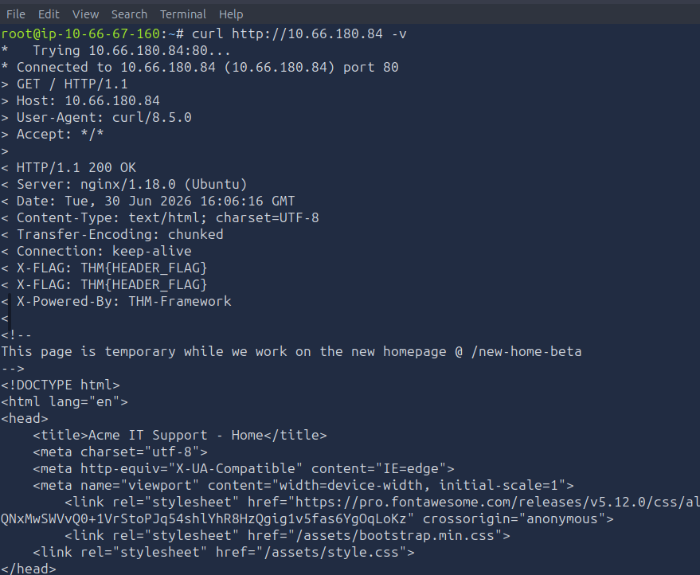

**Manual Discovery - Common Files**

**Robots.txt**

The robots.txt file tells search engine crawlers which pages they may index. Site owners often list sensitive directories here to prevent them from appearing in search results, making it a ready-made list of interesting locations for a penetration tester.

This robots.txt file tells web crawlers - how to interact with the site. It allows all bots to access most of the site (Allow: /) but asks them not to visit /staff-portal. Keep in mind, this is only a guideline for bots, not a security control, so restricted paths may still be accessible if visited directly.

**sitemap.xml:**

Unlike robots.txt (which restricts crawlers), sitemap.xml tells search engines which pages the owner wants listed. These files sometimes include staging pages, old content, or URLs that are hard to reach via the normal site.

**Questions**

1. What is the directory in robots.txt that isn't allowed to be viewed by web crawlers? --> /staff-portal
2. What is the path of the secret area found in sitemap.xml? --> /s3cr3t-area

**Manual Discovery -Headers & Framework Stack**

**HTTP Headers**

When a web server responds to a request, it includes HTTP Headers that can reveal technical details. Headers like Server and X-Powered-By often expose the webserver software and the language or framework the application runs on.

Run the following command against the Acme IT Support web server. The -v flag enables verbose output, which includes the response headers:

curl http://10.66.180.84 -v

**Framework Stack**

Once you've identified the framework (from the favicon, headers, or by inspecting the page source for comments and copyright notices), visit the framework's own website to learn more. Documentation pages often describe default directory structures, admin panel paths, and default credentials.

**Questions:**

1. What is the flag value from the X-FLAG header? --> Check the response haeaders while ruuning curl http://10.66.180.84 -v --> you will get the flag as THM{HEADER_FLAG}.
2. What is the flag from the framework's administration portal? --> THM{CHANGE_DEFAULT_CREDENTIALS} -->? View the Acme IT Support page source at http://10.66.180.84, there's a comment at the bottom of every page with a link to the framework's website. Follow that link and check the documentation to find the administration portal path. Access that path on the Acme IT Support site and log in with the default  admin / admin credentials to retrieve the flag.

**OSINT - Search Engines & Web Tools**

**Google Dorking/Hacking**

Google's advanced search operators let you filter results in ways that can surface sensitive content indexed from your target. By combining operators, you can find exposed admin panels, leaked documents, and login pages that the site owner never intended to be public.

| Filter   | Example              | Description                                         |
|----------|----------------------|-----------------------------------------------------|
| site     | `site:tryhackme.com` | Returns results only from the specified domain      |
| inurl    | `inurl:admin`        | Returns results with the specified word in the URL  |
| filetype | `filetype:pdf`       | Returns results of a specific file type             |
| intitle  | `intitle:admin`      | Returns results with the specified word in the page title |
| intext   | `intext:password`    | Returns results containing the specified word in the body |
| cache    | `cache:tryhackme.com`| Shows Google’s cached version of the page           |

**Wappalyzer**

Wappalyzer(opens in new tab) is a browser extension and online tool that identifies the technologies a website uses, frameworks, CMS platforms, CDNs, analytics tools, payment processors, and more. It can often detect version numbers, which helps when searching for known vulnerabilities. Install it from your browser's extension store and visit any site to see the tech stack immediately.

**Questions**

1. What Google dork operator limits results to a specific site? --> site:
2. What online tool and browser extension identifies what technologies a website is running? --> Wappalyzer

**OSINT - Repositories and Archives**

**Wayback Machine**: 

The Wayback Machine(opens in new tab) is an archive of the Internet dating back to the late 1990s. Search for a domain, and you'll see every snapshot captured over time. This is useful for finding pages that have been removed from the live site but may still be accessible: old login forms, forgotten API endpoints, or content that was published briefly before being taken down.

**GitHub**

Git(opens in new tab) is a version control system that tracks changes to files over time. GitHub is the most widely used cloud-hosted platform for Git repositories. Developers sometimes accidentally commit sensitive data: API keys, credentials, configuration files, and .env files, before realising the repository is public.

Search GitHub for the company name or domain you're targeting. Once you find a relevant repository, look through the commit history, not just the current files. Sensitive data is often removed in a later commit, but remains in the history.

**S3 Buckets**

Amazon S3(opens in new tab) (Simple Storage Service) is a cloud storage platform that many organisations use to host files and static website content. The URL format for an S3 bucket is https://{name}.s3.amazonaws.com. Bucket owners set permissions, but misconfigurations are common: a publicly accessible bucket can expose files that were never meant to be seen.

Common naming patterns include {company}-assets, {company}-backup, {company}-www, and {company}-dev. Try these patterns against your target's company name. You can also find bucket URLs in the website's page source or in GitHub repositories.

**Questions**

1. What is the website address for the Wayback Machine? --> https://web.archive.org/
2. What URL format do Amazon S3 buckets end in? (Answer starts with a .)  --> .s3.awazonaws.com

**Automated Discovery - Gobuster Fundamnetals**

Manual and OSINT techniques can only take you so far. Automated discovery uses tools to rapidly send hundreds or thousands of requests to a web server to check whether directories, files, or other resources exist. This process relies on wordlists, text files containing commonly used directory names, file names, and paths.

**Gobuster**

Gobuster(opens in new tab) is an open-source enumeration tool written in Go. It supports multiple modes: directory/file enumeration (dir), DNS subdomain enumeration (dns), and virtual host enumeration (vhost). It's pre-installed on the AttackBox and included by default in Kali Linux.

| Flag | Description |
|------|-------------|
| `-t`, `--threads` | Number of concurrent threads (default: 10). Increase for faster scans. |
| `-w`, `--wordlist` | Path to the wordlist file. Required for all modes. |
| `-o`, `--output` | Write results to a file instead of stdout. |
| `--delay` | Wait time between requests; useful against rate-limited servers. |

**Wordlists**

SecLists is the mostly widely used collection and the path is /usr/share/wordlists/SecLists/. For Directory Enumeration, Discovery/Web-Content/common.txt and Discovery/Web-Content/directory-list-2.3-medium.txt cover most scenarios.

dir mode: The dir mode brute forces directories and files on a web server. The basic Syntax is 

gobuster dir -u "http://Machine_IP" -w /path/to/wordlists

The -u flag specifies the target URL that Gobuster will run its discovery against. The -w flag specifies the wordlist fil; a list of directory and file names Gobuster will try against the target one by one. Both -u and -w is required for gobuster to run.

Some additional useful flags for dir mode:

| Flag | Description |
|------|-------------|
| `-x`, `--extensions` | File extensions to search for (e.g., `.php`, `.txt`, `.js`). |
| `-r`, `--followredirect` | Follow HTTP redirects. |
| `-k`, `--no-tls-validation` | Skip TLS certificate verification (useful in lab environments). |
| `-s`, `--status-codes` | Only show specific status codes (e.g., `200`, `301`). |

**Questions**:

1. What is the name of the directory beginning with /mo that was discovered?--> /monthly, run the gobuster scan is dir mode - will be able to get the results.
2. What is the name of the log file that was discovered? --> development.log

**Automated Discovery - subdomains & virtual hosts:**

This is about DNS mode and vhost mode. The dns mode allows gobuster to bruteforce subdomains.During a penetration test,  checking the subdomains of your target’s top domain is essential. Just because something is patched in the regular domain, it doesn't mean it is also patched in the subdomain. An opportunity to exploit a vulnerability in one of these subdomains may exist.

For example, if TryHackMe owns tryhackme.thm and mobile.tryhackme.thm, there may be a vulnerability in mobile.tryhackme.thm that is not present in tryhackme.thm. That is why it is important to search for subdomains as well!

Difference between subdomains and VHOSTS:

| Aspect | Subdomain | Virtual Host (VHost) |
|----------|----------|----------|
| Definition | A DNS record that points to a domain hierarchy below the main domain. | A web server configuration that serves different content based on the `Host` header. |
| Example | `blog.example.com`, `admin.example.com` | `dev.example.com` hosted on the same server but only accessible via the correct `Host` header. |
| Exists in DNS? | Yes, typically requires a DNS record. | Not necessarily. A VHost can exist without a public DNS record. |
| Discovered By | DNS enumeration, CT logs, OSINT, brute-forcing. | VHost fuzzing using different `Host` headers. |
| Server Requirement | DNS must resolve the hostname to an IP address. | Web server must be configured to respond to the hostname. |
| Typical Goal | Identify publicly reachable applications and services. | Identify hidden applications hosted on the same web server. |
| Example Tool | `subfinder`, `amass`, `assetfinder` | `ffuf`, `gobuster`, `wfuzz` (VHost mode) |
| Pentesting Question Answered | "What hostnames exist in DNS?" | "What sites does this web server serve for different Host headers?" |

Preparing the tryhackme environment :

We are going to work in a local enviroment with a DNS server on the web server. To ensure we can resolve the domains used through out this room. you need to change the /etc/resolv-dnsmasq file:

/etc/resolv-dnsmasq (or more commonly /etc/resolv.dnsmasq) is a file used by dnsmasq to define the upstream DNS servers that dnsmasq should forward queries to. Instead of reading /etc/resolv.conf, dnsmasq can be configured to use this separate file via the resolv-file option.

1. Open the file and insert nameserver 10.67.161.235 as the first line
2. Save the file
3. Restarth the DNSMASQ service by running the command /etc/init.d/dnsmasq restart.

Updating the Host file:

To ensure the domain used in this room resolves correctly, we need to map the target IP using the /etc/hosts file

1. Open the file and add 10.67.161.235 example.thm
2. Save the file and ping it to the example.thm.

Explaining the preparing the environment concept

Editing the /etc/resolv-dnsmasq and adding nameserver 10.67.161.235 --> dnsmasq is a local DNS forwarder/cache. When your machine needs to resolve a hostname (e.g., admin.example.thm), dnsmasq asks an upstream DNS server. By adding nameserver - "Use the lab's DNS server at 10.67.161.235 to resolve domain names."

Editing the /etc/hosts --> you are maping an IP Address to an domain.

**DNS Mode:**

The dns mode performs DNS lookups using wordlists as subdomain candidates. The required flags -d (domain) and -w (wordlists):

The dns mode performs DNS lookups using wordlist entries as subdomain candidates. The required flags are -d (domain) and -w (wordlist). The --wildcard option in Gobuster is used to force enumeration even when wildcard DNS is detected, allowing results to be returned despite potential false positives.

Run the command:  gobuster dns -d example.thm -w /usr/share/wordlists/SecLists/Discovery/DNS/subdomains-top1million-5000.txt --wildcard

Some useful flags are as follows

| Flag | Description |
|------|-------------|
| `-d`, `--domain` | The target domain to enumerate |
| `-i`, `--show-ips` | Show the IP addresses that subdomains resolve to |
| `-r`, `--resolver` | Use a custom DNS server for lookups |

vhost Mode: 

The vhost mode doesn't use DNS. Instead, it sends HTTP requests to the target IP, cycling through wordlist entries as the Host: header value. This finds virtual hosts that aren't registered in public DNS.

Run the vhost scan with the following commands. The --append-domain flag tells Gobuster to combine each wordlist entry with the domain, and --exclude-length filters out false positives that share a common response size:

The vhost mode doesn't use DNS. Instead, it sends HTTP requests to the target IP, cycling through wordlist entries as the Host: header value. This finds virtual hosts that aren't registered in public DNS.

gobuster vhost -u "http://10.67.161.235" --domain example.thm -w /usr/share/wordlists/SecLists/Discovery/DNS/subdomains-top1million-5000.txt --append-domain --exclude-length 250-320

Review the results and identify the virtual hosts responding with a 200 OK status. Access each one in your browser to explore what's hosted there.

**Questions:**

1. Apart from dns and -w, which shorthand flag is required for dns mode? --> -d
2. How many virtual hosts on acmeitsupport.thm respond with status code 200? 3

