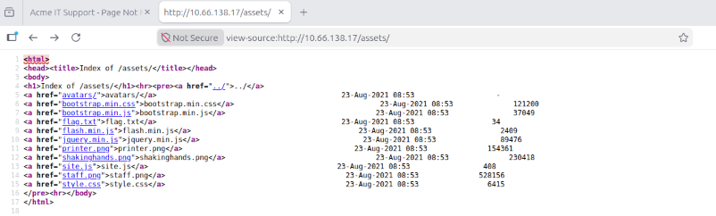
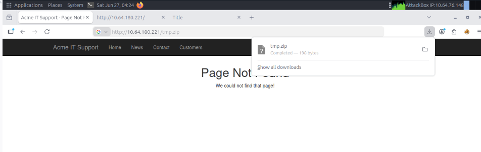
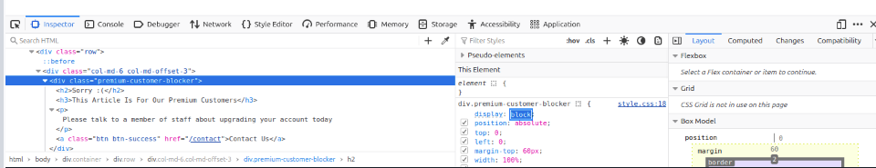

**Exploring the website:**

As a penetration tester - your role is to review the website or web application and identify features that could be vulnerable and attempt to exploit them to assess whether they are. These features are part of the website that require user interaction.

Excellent part to start is just with your browser.

Below mentioned is the site review for the Acne IT Support website:

| Feature                 | Endpoint                | Summary                                                                                                                                                       |
| ----------------------- | ----------------------- | ------------------------------------------------------------------------------------------------------------------------------------------------------------- |
| Home Page               | `/`                     | This page contains a summary of what Acme IT Support does, along with a company photo of its staff.                                                           |
| Latest News             | `/news`                 | This page contains a list of recently published news articles by the company, and each news article has a link with an ID number (i.e. `/news/article?id=1`). |
| News Article            | `/news/article?id=1`    | Displays the individual news article. Some articles seem to be blocked and reserved for premium customers only.                                               |
| Contact Page            | `/contact`              | This page contains a form for customers to contact the company. It contains name, email, and message input fields, along with a send button.                  |
| Customers               | `/customers`            | This link redirects to `/customers/login`.                                                                                                                    |
| Customer Login          | `/customers/login`      | This page contains a login form with username and password fields.                                                                                            |
| Customer Signup         | `/customers/signup`     | This page contains a user signup form with input fields for username, email, password, and password confirmation.                                             |
| Customer Reset Password | `/customers/reset`      | Password reset form with an email address input field.                                                                                                        |
| Customer Dashboard      | `/customers`            | This page lists the user's submitted tickets to the IT support company and includes a **Create Ticket** button.                                               |
| Create Ticket           | `/customers/ticket/new` | This page contains a form with a textbox for entering the IT issue and a file upload option to create an IT support ticket.                                   |
| Customer Account        | `/customers/account`    | This page allows the user to edit their username, email and password.                                                                                         |
| Customer Logout         | `/customers/logout`     | This link logs the user out of the customer area.                                                                                                             |

**Questions:**

1. What is the endpoint for creating new tickets? --> /customers/ticket/new

**Viewing the page source:**

Most browsers also support putting view-source in front of the URL, for example, view-source:https://www.google.com/.

To view the source of the page, right click and select View Page Source from the menu:

Some of the important parts of page source are as follows:

1. At the top of the page --> you will notices some code starting with <!-- and ending with -->, these are comments. Comments are messages left by the website developer, usually to explain something in the code to other programmers or even notes/reminders for themselves.
2. Links to different pages in HTML are written in anchor tags (these are HTML elements that start with <a), and the link that you'll be directed to is stored in the href attribute.
3. In some of the website --> the page source has a tag called secr that is used to hide hidden link.
4. External files such as CSS, Java Script and images can be concluded using the HTML code. In this example, you will notice that these fiels area stored in the same directory. If you view this directory in your web browser, you should see a configuration error: either a blank page or a 403 Forbidden page with an error stating you don't have access to the directory. Instead, the directory listing feature has been enabled, which actually lists every file in the directory. Sometimes this isn't an issue, and all the files in the directory are safe for public viewing, but in some cases, backup files, source code, or other confidential information could be stored here.
5. Many websites these days aren't built from scratch; they use a framework. A framework is a collection of pre-made code that makes it easy for developers to include common features a website would require, such as blogs, user management, form processing, and more, saving developers hours or days of development time.

Viewing the page source can often give us clues into whether a framework is in use and, if so, which framework and even what version. Knowing the framework and version can be a powerful find, as there may be public vulnerabilities in the framework, and the website might not be using the most up-to-date version. At the bottom of the page, you'll find a comment about the framework and its version in use, along with a link to the framework's website. Viewing the framework's website, you'll see that our website is, in fact, out of date.

**Questions**

1. What is the flag from the HTML comment? --> THM{HTML_COMMENTS_ARE_DANGEROUS} --> Check the comments in the source code, visit the directory to get the flag. That is http://Machine-IP/new-home-beta.
2. What is the flag from the secret link? --> THM{NOT_A_SECRET_ANYMORE} --> Search for secr in the source code and visit the secret site to get the flag
3. What is the directory listing flag? --> THM{INVALID_DIRECTORY_PERMISSIONS}
   
4. What is the framework flag? --> go to the source code --> End of the source code you will find framework url. In the framework page go to change log , which says V1.2 had an issue where our backup process was creating a file in the web directory called /tmp.zip which potentially could of been read by website visitors. This file is now stored in an area that is unreadable by the public. No use this vulnerabiltiy to be exploited. visit http://Machine_ip/tmp.zip. Zip file gets downloaded and extract the file to get the flag. --> THM{KEEP_YOUR_SOFTWARE_UPDATED}
   

**Developer Tools - Inspector**

Every modern browser includes developer tools; this is a toolkit used to aid web developers in debugging web applications and gives you a peek under the hood of a website to see what is going on. As pentesters, we can leverage these tools to gain a much better understanding of the web application. We're specifically focusing on three features of the developer toolkit: Inspector, Debugger and Network.

**Inspector:**

The page source doesn't always reflect what's shown on a webpage; CSS, JavaScript, and user interaction can change the page's content and style, so we need a way to view what's been displayed in the browser window at this exact time. The Inspector tab provides a live view of what is currently on the website. In addition to viewing this live view, we can also edit and interact with page elements, which is helpful for web developers to debug issues.

On the Acme IT Support website, click into the News section, where you'll see three news articles. The first two articles are readable, but the third is blocked by a floating notice above the content stating that you need a premium subscription to view it. These floating boxes that block page content are often called paywalls, as they put up a metaphorical wall in front of the content you want to see until you pay.

Right-click the premium notice (paywall), then select Inspect from the menu to open the developer tools at the bottom or right-hand side, depending on your browser or preferences.

In the Inspector tab, you'll now see the elements/HTML that make up the website.

Locate the DIV element with the class premium-customer-blocker, and then click on it. You'll see all the CSS styles in the styles box that apply to this element, such as margin-top: 60px and text-align: center. The style we're interested in is the display: block. If you click on the word block, you can type a value of your own choice. Try typing none, and this will make the box disappear, revealing the content underneath it and a flag. If the element didn't have a display field, you could click the bottom of the last style and add your own. 

**Questions:**

1. What is the flag behind the paywall? --> Change the value shown below into none to remove the paywall and get the flag. --> THM{NOT_SO_HIDDEN}
   

**Developer Tools - Debugger**

This panel in the developer tools is intended for debugging JavaScript, and again is an excellent feature for web developers wanting to work out why something might not be working. But as penetration testers, we can dig deep into the JavaScript code. In Firefox and Safari, this feature is called Debugger, but in Google Chrome, it's called Sources.

   

