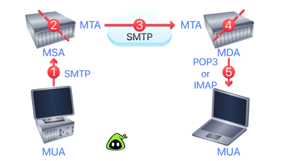
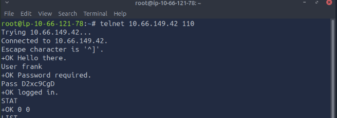
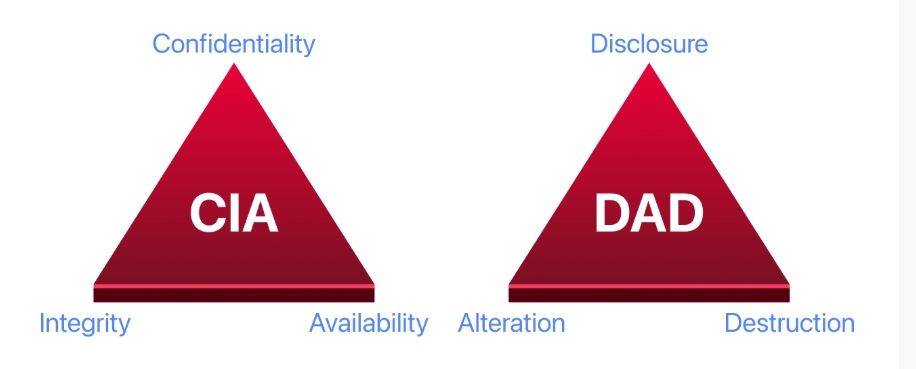
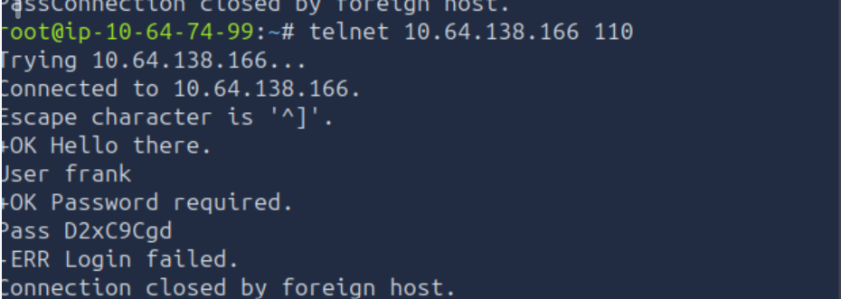
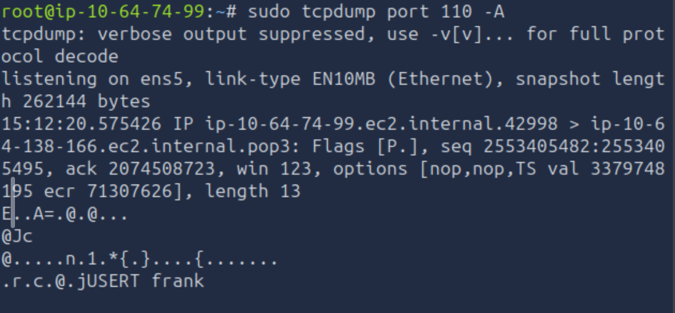
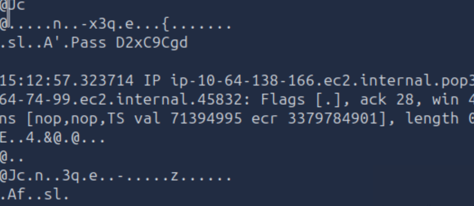
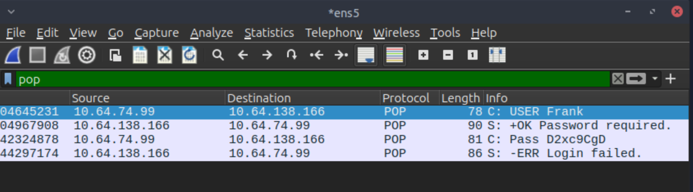
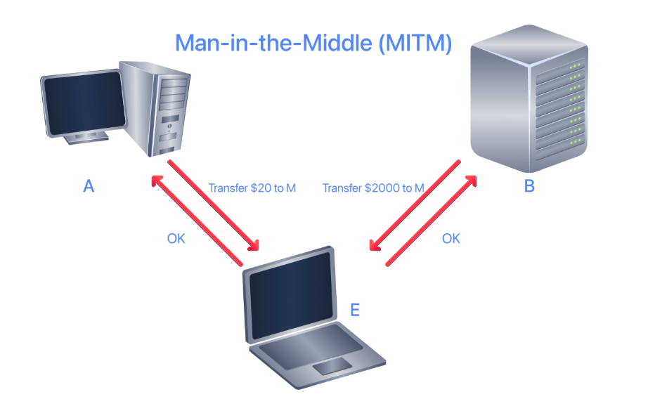
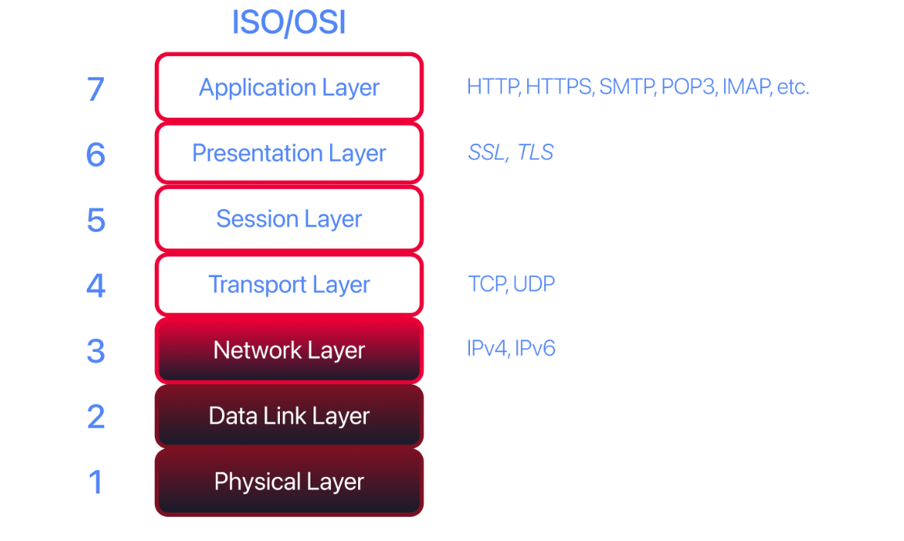
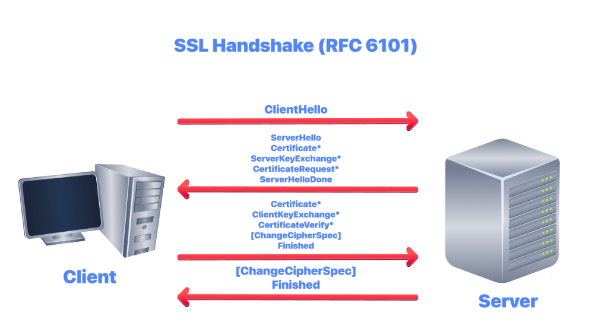

**Telnet:**

The Telnet protocol is an application-layer protocol used to connect to a virtual terminal of another computer. Using Telnet, a user can log into a remote machine and access its terminal (console) to run programs, start batch processes, and perform system administration tasks remotely.

The Telnet protocol is relatively simple. When a user connects, they are asked for a username and password. Upon correct authentication, the user gains access to the remote system's terminal. However, all communication between the Telnet client and the Telnet server is unencrypted, making it an easy target for attackers.

Telnet Today

Telnet was widely used for remote administration in the early days of networking. However, it has been almost entirely replaced by SSH for interactive remote access. It is very unlikely to find telnet enabled on modern, properly configuted systems. However it has been completly replaced by SSH for interactive remote access.

Telnet Client as a testing tool:

While Telnet servers are rare, the Telnet client remains useful as a simple tool for connecting to any TCP port and manually interacting with text-based protocols.

How telnet works : 

A Telnet server listens for incoming connections on port 23 using the Telnet protocol. The following terminal output is illustrative and was captured from a separate environment. The Telnet port is not open on the target VM attached to this room, so you will not be able to replicate this specific connection. However, it demonstrates the authentication flow clearly.

The steps are as follows:

1. The user is asked to provide their login name (username). In this example, the user enters frank.
2. They are then asked for the password, D2xc9CgD. The password is not shown on the screen; however, it is displayed below for demonstration purposes.
3. Once the system checks the login credentials, the user is greeted with a welcome message.
4. The remote server grants a command prompt, frank@bento:~$. The $ indicates that this is not a root terminal.

Why Telnet is Insecure

Telnet is no longer considered a secure option. Anyone capturing your network traffic can discover your usernames and passwords, which would grant them access to the remote system. This includes:

1. Attackers on the same network segment
2. Anyone who has compromised a router or switch along the path
3. Malicious insiders with network access
4. Anyone performing a successful man-in-the-middle attack

Questions:

To which port will the telnet command with the default parameters try to connect? --> 23

**Hypertext Transfer Protocol (HTTP)**

Hypertext Transfer Protocol (HTTP) is the protocol used to transfer web pages. Your web browser connects to the web server and uses HTTP to request HTML pages, images, and other files. It also submits forms and uploads various files. Any time you browse the World Wide Web (WWW), you are using the HTTP protocol.

HTTP vs HTTPS

HTTP sends and receives data as cleartext (not encrypted). This means anyone with access to the network traffic can read the content being transferred, including sensitive information like login credentials and personal data.

Today, the vast majority of websites use HTTPS (HTTP Secure), which wraps HTTP inside TLS encryption. Modern browsers mark plain HTTP sites as "Not Secure", and some features (like geolocation and camera access) are blocked entirely on non-HTTPS sites. However, understanding how HTTP works is still essential because:

1. The HTTP commands and structure are identical whether using HTTP or HTTPS.
2. You will encounter HTTP during internal penetration tests and on legacy systems.
3. Understanding the protocol helps you identify and exploit web vulnerabilities.
4. Tools like Burp Suite decrypt HTTPS traffic for analysis, showing you raw HTTP.
F
or this demonstration, plain HTTP is used so you can see exactly what is being transmitted.

Manually Sending HTTP Requests

Because HTTP is a cleartext protocol, you can use a simple tool such as Telnet (or Netcat) to communicate with a web server and act as a "web browser". The key difference is that you need to input the HTTP-related commands instead of the web browser doing that for you.

In the following example, you will see how to request a page from a web server and discover the web server version. The Telnet client is used because Telnet is a simple protocol that uses cleartext for communication. The steps are as follows:

1. Connect to port 80 using telnet 10.64.159.224 80.
2. Type GET /index.html HTTP/1.1 to retrieve the page index.html, or GET / HTTP/1.1 to retrieve the default page.
3. Provide a value for the host header, such as host: telnet, and press the Enter/Return key twice.

In the console output below, the requested page is recovered along with information not usually displayed by the web browser. If the requested page is not found, the server returns error 404.

Information Revealed in HTTP Headers

1. Specific versions may have known vulnerabilities you can research.
2. The OS information helps tailor further attacks.
3. Even knowing the web server software narrows down potential attack vectors.

An HTTP server (web server) and an HTTP client (web browser) are required to use the HTTP protocol. The web server "serves" a specific set of files to the requesting web browser.

Popular choices for HTTP servers include:

1. Nginx has become the most widely used web server on the internet, known for its performance and efficiency in handling concurrent connections. It is free and open-source.
2. Apache remains extremely popular and powers a large portion of websites. It is highly configurable with a vast ecosystem of modules. It is also free and open-source.
3. Internet Information Services (IIS) is Microsoft's web server, commonly found in Windows enterprise environments. It requires a Windows Server licence.

Other notable web servers include LiteSpeed, Caddy (which has automatic HTTPS built in), and Node.js for JavaScript-based applications.

Questions: 

Launch the attached VM. From the AttackBox terminal, connect using Telnet to 10.64.159.224 80 and retrieve the file flag.thm. What does it contain?

Connect telnet <IP Address> 80
GET /flag.thm HTTP/1.1
host: telnet

**File Trasfer Protocol** 

File Transfer Protocol (FTP) was developed to make the transfer of files between different computers with different systems efficient. It was one of the earliest protocols designed for the internet and remains in use today, though it has largely been replaced by secure alternatives for most purposes.

Modern FTP

FTP sends credentials and data in cleartext, making it insecure for transferring sensitive information. For this reason, FTP has been replaced in most environments by:

1. SFTP (SSH File Transfer Protocol) runs over SSH on port 22 and encrypts all traffic. This is the most common replacement for FTP.
2. FTPS (FTP Secure) adds TLS encryption to the FTP protocol on port 990 (implicit TLS) or uses STARTTLS on port 21.
3. SCP (Secure Copy Protocol) also runs over SSH, though it is being deprecated in favour of SFTP.

Manually interacting with FTP:

FTP sends and receives data as cleartext, so you can use Telnet to communicate with an FTP Server and act as FTP Client.

1. A connection was made to an FTP server using a Telnet client. Since FTP servers listen on port 21 by default, the Telnet client was directed to connect to port 21 instead of the default Telnet port.
2. The username was provided with the command USER frank.
3. The password was provided with the command PASS D2xc9CgD.
4. Because the correct username and password were supplied, login succeeded.

A command like STAT can provide additional information. The SYST command shows the System Type of the target (UNIX in this case). PASV switches the mode to passive. It is worth noting that there are two modes for FTP:

1. Active: In active mode, the data is sent over a separate channel originating from the FTP server's port 20. The server initiates the data connection back to the client. This often fails when the client is behind a firewall or NAT.
2. Passive: In passive mode, the data is sent over a separate channel originating from an FTP client's port above port number 1023. The client initiates both connections. This is more firewall-friendly and is the default for most modern FTP clients.

The comamnd TYPE A switches the file transfer to ASCII Mode, while TYPE 1 switches the file transfer mode to binary. However, file transfer cannot be completed using a simple client such as Telnet because FTP creates a seperate connection for data transfer.

Notice in the STAT output that the server explicitly states "Control connection is plain text" and "Data connections will be plain text". This confirms that everything, including credentials, is transmitted without encryption.

Difference between ASCII mode and binary mode in ftp via telnet

When using FTP via Telnet, you can switch between ASCII mode and binary mode depending on the type of data you’re transferring. The key difference lies in how the data is interpreted and transmitted.

ASCII Mode: Used for text files (e.g., .txt, .html, .csv, source code files).

How it works:

1. Transfers data as characters (text).
2. Performs character encoding conversion if needed (e.g., different newline formats between systems).

Binary Mode: Used for non-text files, such as jpeg, executables etc.

How it works

1. Transfers data byte-by-byte exactly as is.
2. No conversion or interpretation is performed.

|  Feature | ASCII Mode | Binary Mode |
|----------|------------|-------------|
| Data type | All Text files | All file types |
|Conversion| Yes (line endings, encoding) |No conversion at all|
| Risk of Corruption | Yes (for non-text files) | No|
| Transfer method | Character-based | Byte-Byte|
| Default use case | .txt, .html | .jpeg,.exe |

Using FTP CLient :

Instead of using the telnet client if you need to run the ftp client - Execute the command ftp <IP Address>

After logging in successfully, you get the FTP prompt, ftp>, to execute various FTP commands. In the example below, ls lists the files, ascii switches to ASCII mode since the target is a text file (not binary), and get FILENAME initiates the file transfer by establishing a separate data channel.

Annonymous FTP:

Some FTP servers allow anonymous login, typically using the username anonymous or ftp with any email address as the password (or no password at all). Anonymous FTP was historically used for public file distribution, such as software downloads and documentation. During penetration testing, always try an anonymous login when you discover an FTP server.

Anonymous FTP servers might contain sensitive files that were accidentally exposed, configuration backups, or provide a way to upload malicious files if write access is enabled.

FTP Servers and Clients
There are various FTP server software options available:

1. vsftpd (Very Secure FTP Daemon) is one of the most common FTP servers on Linux systems.
2. ProFTPDis highly configurable and modular.
3. Pure-FTPd(opens in new tab) focuses on security and simplicity.
4. On Windows, IIS includes FTP server capabilities.
   
For FTP clients, in addition to the console FTP client commonly found on Linux systems, you can use a GUI-based client such as FileZilla. Note that major web browsers have removed FTP support in recent years, so browser-based FTP access is no longer available.

Security Implications:

Because FTP sends login credentials, commands, and files in cleartext, FTP traffic is an easy target for attackers. Anyone capturing network traffic can see usernames and passwords, file contents being transferred, directory listings revealing server structure, and the commands showing what actions users are performing. If you must use FTP, restrict it to isolated networks or use FTPS with TLS encryption. For most purposes, SFTP over SSH is the recommended alternative

Questions:

1. For this task, use the FTP client on the AttackBox to connect to 10.65.151.200. The credentials are frank / D2xc9CgD.

Flag: THM{364db6ad0e3ddfe7bf0b1870fb06fbdf}

**Simple Mail Transfer Protocol:**

Email is one of the most used services on the Internet. There are various configurations for email servers; for instance, you may set up an email system to allow local users to exchange emails with each other with no access to the Internet. However, this task considers the more general setup where different email servers connect over the Internet.

Email Delivery Components

Email delivery over the Internet requires the following components:

1. Mail User Agent (MUA): The email client (e.g., Thunderbird, Outlook, a webmail interface).
2. Mail Submission Agent (MSA): Receives mail from the MUA, checks for errors, and forwards it.
3. Mail Transfer Agent (MTA): Routes and delivers mail between servers.
4. Mail Delivery Agent (MDA): Stores the email in the recipient's mailbox for retrieval.

The figure shows the following five steps that an email needs to go through to reach the recipient's inbox:

1. The MUA has an email message to be sent. It connects to the MSA to submit the message.
2. The MSA receives the message, checks for any errors before transferring it to the MTA, which is commonly hosted on the same server.
3. The MTA sends the email message to the MTA of the recipient. The MTA can also function as an MSA.
4. A typical setup has the MTA server also functioning as the MDA.
5. The recipient collects their email from the MDA using their email client (MUA).

If the above steps sound confusing, consider the following analogy:

1. You (MUA) want to send postal mail.
2. The post office employee (MSA) checks the postal mail for any issues before your local post office (MTA) accepts it.
3. The local post office checks the mail destination and sends it to the post office (MTA) in the correct country.
4. The post office (MTA) delivers the mail to the recipient's mailbox (MDA).
5. The recipient (MUA) regularly checks the mailbox for new mail. They notice the new mail and take it.

Email Protocols

In the same way you follow a protocol to communicate with an HTTP server, you rely on email protocols to talk with an MTA and an MDA. The protocols are:

1. Simple Mail Transfer Protocol (SMTP) for sending email
2. Post Office Protocol version 3 (POP3) or Internet Message Access Protocol (IMAP) for receiving email

SMTP is explained in this task. POP3 and IMAP are covered in the following two tasks.

Simple Mail Transfer Protocol (SMTP) is used to communicate with an MTA server. The original SMTP uses cleartext, where all commands are sent without encryption. However, modern email infrastructure uses several ports with different security models:

1. Port 25 is the traditional SMTP port used for server-to-server communication (MTA to MTA). It is often blocked by ISPs for residential connections to prevent spam. On port 25, encryption is optional and negotiated via STARTTLS.
2.  Port 587 is the submission port, used by email clients (MUA) to submit messages to their mail server (MSA). This is the recommended port for sending email and typically requires authentication. TLS encryption is negotiated via the STARTTLS command.
3.  Port 465 was originally designated for SMTPS (SMTP over implicit TLS), then deprecated, and has since been reinstated. On this port, TLS encryption begins immediately upon connection.

Manual Sending Email via Telnet

Because SMTP can use cleartext, you can use a basic Telnet client to connect to an SMTP server and act as an email client (MUA), sending a message. Once connected, issue helo hostname (or ehlo hostname for extended SMTP) and then start composing the email.

After helo, the commands mail from: and rcpt to: indicate the sender and the recipient. When the email message is ready, the data command begins the message body. The message is ended by typing a period on a line by itself (. followed by Enter). The SMTP server then queues the message.

**Email Spoofing:**

Notice something important in the example above: the "from" address was specified manually, and the server accepted it without verifying that the sender actually controls that email address. This is how email spoofing works. SMTP was designed in an era of trusted networks and has no built-in mechanism to verify sender identity.

Security Implications

Understanding SMTP is important for security professionals because:

1. Email remains the primary vector for phishing attacks.
2. Misconfigured mail servers can be used as open relays for spam.
3. Cleartext SMTP exposes email content and credentials to network sniffing.
4. Knowledge of SMTP helps you understand email header analysis during incident response.

During penetration tests, you might test for open relay configurations, attempt email spoofing to assess security awareness, or analyse email headers to trace the origin of suspicious messages.

Questions:

Using the AttackBox terminal, connect to the SMTP port of the target VM. What is the flag that you can get?

THM{5b31ddfc0c11d81eba776e983c35e9b5}

Post Office Protocol 3 (POP3)

Post Office Protocol version 3 (POP3) is a protocol used to download email messages from a Mail Delivery Agent (MDA) server, as shown in the figure below. The mail client connects to the POP3 server, authenticates, downloads the new email messages, and then (optionally) deletes them from the server.

POP3 Ports and Encryption

Like other protocols covered in this room, POP3 was designed without encryption:

Port 110 is the default POP3 port using cleartext. Some servers support upgrading the connection to TLS using the STLS command (similar to STARTTLS in SMTP).
Port 995 is used for POP3S (POP3 over implicit TLS). The connection is encrypted from the start.

Most email providers today require or strongly encourage POP3S on port 995. However, you may still encounter plaintext POP3 on internal networks, legacy systems, or misconfigured servers.

POP3 Commands

| Command | Description |
|---------|-------------|
| USER username | Identifies the user|
| Pass password | Authenticates with the password |
| STAT | Returns the number of messages and the total size |
| LIST | Lists all messages with their sizes |
| RETR n | Retrieves message number n |
| DELE n | Marks message n for deletion |
| RSET |Resets (unmarks) messages marked for deletion |
| QUIT | Ends the session and deletes marked messages |

POP3 Behaviour: Download and Delete

Based on the default settings, the mail client deletes the mail message after it downloads it. This "download and delete" model means:

1. Emails are stored locally on your device, not on the server.
2. Once downloaded, the email is only accessible from that specific device.
3. If your device is lost or damaged, the emails are gone (unless backed up).
4. Storage on the mail server is minimised.

POP3 vs IMAP: When to Use Each

POP3 is still useful in specific scenarios:

1. When you want to access email offline and have limited or unreliable internet connectivity
2. When you need to minimise server-side storage
3. When you only access email from a single device
4. For archiving emails locally

However, IMAP has largely replaced POP3 for most users because of its synchronisation capabilities.

Security Implications

From a security perspective, finding a POP3 server (especially on port 110) during a penetration test presents opportunities. Credentials sent over cleartext POP3 can be captured through network sniffing, password attacks can be conducted against POP3 authentication, and successful access to a mailbox may reveal sensitive information, credentials for other systems, or password reset links.

Questions: 

1. Connect to the VM (10.66.149.42) at the POP3 port. Authenticate using the username frank and password D2xc9CgD. What is the response you get to STAT? --> +OK 0 0

3. How many email messages are available to download via POP3 on 10.66.149.42? --> 0

STAT results give you the answer count to be zero

**Internet Message Access Protocol (IMAP)**

Internet Message Access Protocol (IMAP) is more sophisticated than POP3. IMAP makes it possible to keep email synchronised across multiple devices (and mail clients). If you mark an email message as read when checking your email on your smartphone, the change is saved on the IMAP server (MDA) and replicated on your laptop when you synchronise your inbox.

Why IMAP Became the Standard
IMAP has largely replaced POP3 for most users because of how email is accessed today. People check email from their phones, laptops, tablets, and web browsers, often switching between devices throughout the day. IMAP's server-side storage model makes this seamless:

1. Emails remain on the server and are accessible from any device.
2. Read/unread status, folders, and flags are synchronised across all clients.
3. Deleting an email on one device removes it everywhere.
4. Search can be performed server-side without downloading all messages.

This is in contrast to POP3's download-and-delete model, where each device has its own separate copy of messages.

IMAP Ports and Encryption

Like other email protocols, IMAP was originally designed without encryption:

1. Port 143 is the default IMAP port using cleartext. Many servers support upgrading the connection to TLS using the STARTTLS command.
2. Port 993 is used for IMAPS (IMAP over implicit TLS). The connection is encrypted from the start.

Understanding the IMAP Response

Notice the server's initial response includes CAPABILITY, which lists what features the server supports. This is useful information during reconnaissance:

1. IMAP4rev1 indicates the IMAP version.
2. STARTTLS means the server supports upgrading to an encrypted connection.
3. IDLE allows the server to push notifications of new mail.
4. ACL indicates access control list support.

The LIST command revealed the folder structure: INBOX, Trash, Drafts, Templates, and Sent. This tells you about the mailbox organisation and confirms successful authentication.

Common IMAP Commands

| Command | Description |
|---------|-------------|
| LOGIN username password | Authenticates the user |
| LIST "" "*" | Lists all mailbox folders |
| SELECT folder | Opens a folder for read/write access |
| EXAMINE folder | Opens a folder for read-only access |
|FETCH n BODY[]| Retrieves message number n |
| SEARCH criteria | Searches for messages matching criteria |
| STORE n +FLAGS (\Seen) | Marks message n as read |
| LOGOUT | Ends the session |

IMAP vs Webmail

Many users today access email through web interfaces (Gmail, Outlook.com, etc.) rather than dedicated mail clients. These web interfaces use HTTPS to secure the connection between the browser and the mail provider's servers. However, the underlying mail storage still uses IMAP concepts, and many users configure traditional mail clients alongside webmail access.

Understanding IMAP remains relevant because enterprise environments often run their own mail servers with IMAP access, penetration testers may encounter IMAP services during assessments, mobile devices and desktop mail clients still use IMAP extensively, and compromised IMAP credentials provide deeper access than webmail in some scenarios.

Security Implications
IMAP sends the login credentials in cleartext, as shown in the command LOGIN frank D2xc9CgD. Anyone observing the network traffic would be able to see Frank's username and password.

Beyond credential exposure, compromised IMAP access is particularly valuable to attackers because:

1. Persistent access: Unlike POP3, emails remain on the server. An attacker with IMAP credentials can continue reading new emails indefinitely.
2. Historical data: The entire mailbox history is accessible, potentially containing years of sensitive communications.
3. Password reset abuse: Attackers can search for password reset emails to gain access to other accounts.
4. Business email compromise: Access to corporate email enables invoice fraud, impersonation, and data theft.
5. Lateral movement: Emails often contain credentials, internal documentation, and information useful for further attacks.

Questions: 

What is the default port used by IMAP? --> 143

Conclusion: 

Protocol Reference: 

| Protocol|	TCP Port |	Application(s)	| Data Security |	Secure Alternative	| Secure Port |
|---------|----------|-------------------|---------------|----------------------|--------------|
| FTP |	21	| File Transfer |	Cleartext	|FTPS or SFTP	| 990 (FTPS), 22 (SFTP) |
| HTTP |	80	| Worldwide Web |	Cleartext	| HTTPS	| 443|
| IMAP|	143| 	Email (MDA) |	Cleartext	| IMAPS	| 993 |
| POP3|	110|	Email (MDA)	|Cleartext	| POP3S	| 995|
| SMTP| 	25	| Email (MTA) |	Cleartext|	SMTPS or SMTP with STARTTLS |	465 (SMTPS), 587 (Submission) |
| Telnet |	23	| Remote Access	| Cleartext |	SSH	| 22 |

**Protocols and Servers 2**

Telnet
HTTP
FTP
SMTP
POP3
IMAP

Above mentioned protocols  were designed decades ago when security was not a primary concern. They transmit data, including credentials, in cleartext. While the protocols themselves are still in use, modern deployments almost always use encrypted versions: HTTPS instead of HTTP, SFTP or FTPS instead of FTP, SMTPS instead of SMTP, and so on. Telnet has been largely replaced by SSH for remote administration. Understanding the insecure versions helps you recognise misconfigurations, legacy systems, and the underlying mechanics that the secure versions build upon.

Servers implementing these protocols are subject to different kinds of attacks:

1. Sniffing Attack (Network Packet Capture)
2. Man-in-the-Middle (MITM) Attack
3. Password Attack (Authentication Attack)
4. Vulnerabilities
   
From a security perspective, you always need to think about what you aim to protect. Consider the security triad: Confidentiality, Integrity, and Availability (CIA). Confidentiality refers to keeping the contents of communications accessible only to the intended parties. Integrity is the assurance that any data sent is accurate, consistent, and complete when reaching its destination. Availability refers to being able to access the service when you need it. Different parties will put varying emphasis on these three. For instance, confidentiality would be the highest priority for an intelligence agency. Online banking will put most emphasis on the integrity of transactions. Availability is of the highest importance for any platform making money by serving ads.

Knowing that you are protecting Confidentiality, Integrity, and Availability (CIA), an attack aims to cause Disclosure, Alteration, and Destruction (DAD). The figure below reflects this relationship.

These attacks directly affect the security of the system. Network packet capture violates confidentiality and leads to the disclosure of information. A successful password attack can also lead to disclosure. A Man-in-the-Middle (MITM) attack breaks the system's integrity as it can alter the communicated data. This room focuses on these three attacks because they are integral to protocol design and server implementation.

The Modern Attack Landscape

While the fundamental attack categories remain the same, the landscape has evolved:

- Sniffing attacks are harder on properly configured networks due to widespread TLS adoption, but they remain effective against misconfigured services, internal networks without encryption, and legacy systems.
- MITM attacks are mitigated by technologies like HSTS (HTTP Strict Transport Security), certificate pinning, and Certificate Transparency logs, but they can still succeed when these protections are absent or improperly implemented.
- Password attacks have evolved beyond simple brute force. Attackers now use credential stuffing (trying leaked username/password pairs from breaches), password spraying (trying common passwords across many accounts), and leverage massive breach databases.

Vulnerabilities are of a broader spectrum, and exploited vulnerabilities have different impacts on target systems. For instance, exploiting a Denial of Service (DoS) vulnerability can affect the system's availability, while exploiting a Remote Code Execution (RCE) vulnerability can lead to more severe damage. A vulnerability by itself creates a risk; damage can occur only when the vulnerability is exploited. Vulnerabilities are not covered in this room as they have their own module, Vulnerability Research.

This room focuses on how a protocol can be upgraded or replaced to protect against disclosure and alteration, protecting the confidentiality and integrity of transmitted data. Hydra, a powerful tool for testing password strength by attempting authentication with wordlists, is also introduced. Understanding how attackers approach credential attacks helps you appreciate why strong passwords, account lockout policies, and multi-factor authentication are essential defences.

**Sniffing Attack:**

A sniffing attack refers to using a network packet capture tool to collect information about the target. When a protocol communicates in cleartext, the data exchanged can be captured by a third party to analyse. A simple network packet capture can reveal information such as the content of private messages and login credentials if the data is not encrypted in transit.

**Where Sniffing Attacks Are Still Relevant**

You might think that sniffing attacks are outdated, given the widespread adoption of TLS encryption. However, they remain a significant threat in several scenarios:

- Internal corporate networks where traffic between systems may not be encrypted
- Legacy systems that still use cleartext protocols (older mail servers, embedded devices, industrial control systems)
- Misconfigured services where TLS is available but not enforced
- IoT devices that often use unencrypted protocols for communication
- Wireless networks where attackers within range can capture traffic
- After a successful MITM attack that downgrades or strips encryption

During internal penetration tests and red team engagements, sniffing remains a valuable technique for gathering credentials and understanding how systems communicate.

**Packet Capture Tools**

A sniffing attack can be conducted using an Ethernet (802.3) network card, provided that the user has proper permissions (root permissions on Linux and administrator privileges on Windows). There are many programs available to capture network packets. The following are the most common:

1. Tcpdump is a free, open-source command-line interface (CLI) program that has been ported to work on many operating systems. It is lightweight and available on most Linux systems by default.
2. Wireshark is a free open-source graphical user interface (GUI) program available for several operating systems, including Linux, macOS, and Windows. It provides powerful filtering, protocol dissection, and visualisation capabilities.
3. Tshark is a CLI alternative to Wireshark that uses the same dissection engine. It is useful for scripting and automation.

Other tools worth knowing about include tcpflow for reassembling TCP streams, ngrep for pattern matching in network traffic, and NetworkMiner for extracting files and images from captured traffic. There are also several specialised tools for capturing passwords and complete messages. However, this can still be achieved by Tcpdump and Wireshark with some added effort.

**Practical Example: Capturing POP3 Credentials**

Consider a user checking email messages using POP3. The following example uses Tcpdump to capture the username and password.

This attack requires access to the network traffic. An attacker could achieve this via a wiretap, a switch with port mirroring configured, ARP spoofing on a local network, or a compromised system on the same network segment. Alternatively, the traffic can be accessed by launching a successful Man-in-the-Middle (MITM) attack.

The command used is sudo tcpdump port 110 -A. The sudo prefix is required because packet captures require root privileges. The port 110 filter limits captured packets to those exchanged with the POP3 server (POP3 uses port 110 by default). The -A flag displays the contents of captured packets in ASCII format, making cleartext credentials readable in the output.

In the terminal output above, unimportant packets have been removed for clarity. The username and password were sent in separate packets. The first packet explicitly displays USER frank, while the last packet reveals the password PASS D2xc9CgD.

Wireshark can achieve the same results. In the Wireshark window below, the filter field contains pop. With only POP3 traffic displayed, the captured username and password are visible.

Usefull tcpdump filters

1. Capture traffic on a specific port --> sudo tcpdump port 110 -A
2. Capture traffic to/from specific host --> sudo tcpdump <IP_Address> -A
3. Capture HTTP Traffic --> sudo tcpdump port 80 -A
4. Capture FTP traffic --> sudo tcpdump port 21 -A
5. Write captured packets to a file --> sudo tcpdump -w capture.pcap
6. Read and Analyze capture file --> tcpdump -r capture.pcap -A

**Mitigation**

The primary mitigation is adding an encryption layer on top of the network protocol. Transport Layer Security (TLS) has been added to HTTP, FTP, SMTP, POP3, IMAP, and many others. For remote access, Telnet has been replaced by the secure alternative Secure Shell (SSH).

Additional mitigations include:

1. Network segmentation limits which systems can see each other's traffic by dividing the network into isolated zones.
2. Encrypted VLANs and tunnels protect sensitive traffic even on internal networks.
3. 802.1X port-based authentication requires devices to authenticate before gaining network access, preventing unauthorised devices from connecting and sniffing traffic.
4. Zero trust architecture is a security model that treats all network traffic as potentially hostile, encrypting all communications regardless of whether they originate inside or outside the network perimeter.
5. Monitoring for ARP spoofing and other traffic redirection techniques helps detect sniffing attempts in progress.

**Questions:**

1. What do you need to add to the command sudo tcpdump to capture only Telnet traffic? --> port 23
2. What is the simplest display filter you can use with Wireshark to show only IMAP traffic? --> IMAP

**Man in the Middle Attack**

A Man-in-the-Middle (MITM) attack occurs when a victim (A) believes they are communicating with a legitimate destination (B) but is unknowingly communicating with an attacker (E). In the figure below, A requests the transfer of $20 to M. However, E alters this message and replaces the original value with a new one. B receives the modified message and acts on it

This attack is relatively simple to carry out if the two parties do not confirm the authenticity and integrity of each message. In some cases, the chosen protocol does not provide secure authentication or integrity checking. Some protocols have inherent insecurities that make them susceptible to this kind of attack.

**How MITM Attacks Work**

For an attacker to position themselves between two communicating parties, they typically need to redirect traffic through their system. Common techniques include:

**ARP Spoofing** is effective on local networks. The attacker sends forged ARP (Address Resolution Protocol) messages to associate their MAC address with the IP address of the default gateway or target system. As a result, traffic intended for those systems is sent to the attacker instead.

**DNS Spoofing** involves providing false DNS responses to redirect victims to attacker-controlled servers. This can happen through compromised DNS servers, DNS cache poisoning, or by responding to DNS queries faster than the legitimate server.

**Rogue Access Points** are fake wireless access points set up by attackers. When victims connect to these networks (often named to look like legitimate networks such as Airport_WiFi_Free), all their traffic flows through the attacker's system.

**BGP Hijacking** operates at the internet routing level, where attackers announce false BGP routes to redirect traffic through their infrastructure. This is a more sophisticated attack, typically targeting specific organisations or regions.

**Tools for MITM Attacks**

Many tools can aid in carrying out MITM attacks. Understanding these helps you recognise what attackers can do and why mitigations matter:

**Bettercap** is the modern successor to Ettercap and is actively maintained. It supports ARP spoofing, DNS spoofing, HTTP/HTTPS proxying, and has a modular architecture for various attack scenarios.

**Ettercap** is a classic tool for MITM attacks on LANs. While still functional, Bettercap is generally preferred for modern assessments. Ettercap has three different interfaces:

***Curses (Text-based)**: ettercap -CAn interactive, menu-driven interface inside the terminal, providing a balance of visual navigation without relying on a full desktop environment.
***GTK+ (Graphical):** ettercap -GA full GUI with windows and menus, making it easier to manage lists of hosts, plugins, and attacks using your mouse.
***Text (Console):** ettercap -TA plain text interface that outputs data directly to the command line, ideal for scripting or automation.

**mitmproxy** is an interactive HTTPS proxy that allows inspection and modification of traffic. It is particularly useful for analysing and manipulating HTTP/HTTPS communications.

**Responder** is designed for Windows environments and exploits name resolution protocols such as LLMNR (Link-Local Multicast Name Resolution) and NBT-NS (NetBIOS Name Service). These are fallback protocols that Windows systems use when standard DNS resolution fails. Responder listens for these broadcast queries and responds with its own IP address, tricking victims into sending authentication credentials to the attacker. This is a common technique during internal penetration tests of Active Directory environments.

**MITM Against Encrypted Traffic**

MITM attacks can target HTTPS and other encrypted protocols through several approaches:

1. SSL Stripping downgrades HTTPS connections to HTTP. When a victim tries to connect to a website, the attacker intercepts the request, establishes an HTTPS connection with the legitimate server, but serves the content to the victim over unencrypted HTTP. The victim may not notice the missing padlock icon, especially if they did not explicitly type https://.

2. Fake Certificates involve the attacker presenting their own certificate and establishing separate encrypted connections with both parties. This works if the victim accepts an invalid certificate warning or if the attacker has compromised a Certificate Authority (CA).

3. Compromised or Rogue CAs represent a more serious threat. If an attacker controls a trusted CA (or obtains a fraudulent certificate from one), they can generate valid-looking certificates for any domain.

**Modern Defences Against MITM**

Modern security mechanisms make MITM attacks significantly harder than they were a decade ago:

**HTTPS Everywhere:** Most websites now use HTTPS by default. Major browsers mark HTTP sites as "Not Secure", and some have begun blocking mixed content entirely.

**HSTS (HTTP Strict Transport Security)** tells browsers to only connect via HTTPS for a specified period. Once a browser has seen an HSTS header for a domain, it will refuse to connect over HTTP, preventing SSL stripping attacks. Many major sites are also on the HSTS preload list, meaning browsers ship with knowledge that these sites should only be accessed via HTTPS.

**Certificate Transparency (CT)** requires CAs to log all issued certificates to public, auditable logs. This makes it much harder for attackers to obtain fraudulent certificates without detection. Browsers can check these logs and reject certificates that are not properly logged.

**Certificate Pinning** allows applications to specify exactly which certificates or public keys are valid for their connections. This is common in mobile apps and prevents attacks even if a CA is compromised. However, it makes certificate rotation more complex.

**DANE (DNS-based Authentication of Named Entities)** uses DNSSEC to publish certificate information in DNS records, providing an alternative trust path that does not rely solely on the CA system.

Despite these protections, MITM attacks remain possible when users ignore certificate warnings, applications do not properly validate certificates, the target uses cleartext protocols, the attacker can compromise a trusted CA, internal networks lack encryption, or legacy systems do not support modern security features.

MITM can also affect other cleartext protocols such as FTP, SMTP, and POP3. The fundamental mitigation requires the use of cryptography. The solution lies in proper authentication along with encryption or signing of exchanged messages. With the help of Public Key Infrastructure (PKI) and trusted root certificates, Transport Layer Security (TLS) protects against MITM attacks when properly implemented.

**Questions**

1. How many different interfaces does Ettercap offer? --> 3
2. In how many ways can you invoke Bettercap? --> 3

**Transport Layer Security**

A Brief History of SSL and TLS
SSL (Secure Sockets Layer) originated when the World Wide Web began to see new applications, such as online shopping and sending payment information. Netscape introduced SSL in 1994, with SSL 3.0 being released in 1996. Eventually, more security was needed, and the TLS (Transport Layer Security) protocol was introduced in 1999 with TLS 1.0.

Since then, the protocol has evolved significantly:

1. SSL 2.0 and 3.0 are deprecated and considered insecure. They should never be used.
2. TLS 1.0 and 1.1 were deprecated in 2021 due to known vulnerabilities. Major browsers no longer support them.
3. TLS 1.2 (2008) remains widely used and is considered secure when properly configured with modern cipher suites.
4. TLS 1.3 (2018) is the current standard. It removes outdated cryptographic algorithms, reduces handshake latency, and provides forward secrecy by default.

You will still see the term "SSL" used colloquially (such as "SSL certificate"), but in practice, all modern systems use TLS. When someone says "SSL," they almost always mean TLS.

**Where TLS Fits in the Network Model**

The common protocols covered so far send data in cleartext, making it possible for anyone with access to the network to capture, save, and analyse the exchanged messages. The image below shows the ISO/OSI network layers. The protocols covered so far in this room are on the application layer. Encryption can be added via the presentation layer. As a result, data will be presented in an encrypted format (ciphertext) instead of its original form.

**Location of TLS Fits in the Network Model:**

It is worth noting that the OSI model is a conceptual simplification. In practice, TLS operates between the transport and application layers rather than mapping neatly to a single OSI layer. However, the diagram is useful for understanding that encryption sits below the application protocol, wrapping its data before transmission.

Upgrading Protocols with TLS:

An existing cleartext protocol can be upgraded to use encryption via TLS. The following table lists the protocols covered so far and their default ports before and after the encryption upgrade via TLS.

| Protocol	| Default Port |	Secured Protocol	| Default Port with TLS|
|-----------|--------------|--------------------|----------------------|
| HTTP |	80	| HTTPS |	443 |
| FTP	| 21 |	FTPS	| 990 |
| SMTP|	25|	SMTPS|	465|
| POP3	110|	POP3S	|995|
| IMAP|	143 |	IMAPS |	993 |

TLS is not limited to web and email protocols. DNS can also be secured using TLS. DNS over TLS (DoT) encrypts DNS queries by wrapping standard DNS traffic inside a TLS connection, typically on **port 853**. A related approach, DNS over HTTPS (DoH), sends DNS queries as HTTPS requests on port 443. Both prevent eavesdropping on DNS lookups, which would otherwise reveal which websites a user is visiting.

**There are two approaches to adding TLS to a protocol:**

1. **Implicit TLS** uses a dedicated port (as shown in the table above). The connection is encrypted from the start. When you connect to port 443 for HTTPS or port 993 for IMAPS, TLS negotiation begins immediately.

2. **STARTTLS** allows upgrading an existing cleartext connection to TLS on the same port. The client connects on the standard port (e.g., port 25 for SMTP), and then issues a STARTTLS command to upgrade the connection to TLS. This approach is common for email protocols. For SMTP, port 587 (submission) with STARTTLS is the recommended configuration for mail clients.

Both approaches provide encryption. However, implicit TLS is generally preferred because STARTTLS can be vulnerable to downgrade attacks if not properly implemented. An attacker performing a MITM attack could strip the STARTTLS command from the communication, forcing the connection to remain in cleartext.

**How HTTPS Works**

Consider the case of HTTP. Initially, to retrieve a web page over HTTP, the web browser would need to perform at least the following two steps:

1. Establish a TCP connection with the remote web server.
2. Send HTTP requests to the web server, such as GET and POST requests.

HTTPS requires an additional step to encrypt the traffic. The new step takes place after establishing a TCP connection and before sending HTTP requests. As a result, HTTPS requires at least the following three steps:

1. Establish a TCP connection.
2. Establish a TLS connection.
3. Send HTTP requests to the web server.

**The TLS Handshake**

To establish a TLS connection, the client needs to perform a handshake with the server. The handshake differs between TLS versions. Here is a simplified overview of the TLS 1.2 handshake:

1. ClientHello: The client sends a message indicating its capabilities, including supported TLS versions, cipher suites, and a random value.
2. ServerHello: The server responds with the selected connection parameters, its certificate (a digital file signed by a Certificate Authority to prove the server's identity), and its own random value.
3. Key Exchange: The client and server exchange information needed to generate the shared secret key. The exact process depends on the chosen cipher suite.
4. Finished: Both sides confirm the handshake completed successfully and switch to encrypted communication

**TLS 1.3 Improvements**

TLS 1.3 significantly improves upon earlier versions:

1. Faster handshake: TLS 1.3 requires only one round trip (1-RTT) to establish a connection, compared to two round trips for TLS 1.2. It even supports 0-RTT resumption for returning clients, though this has some security trade-offs.
2. Forward secrecy by default: All TLS 1.3 cipher suites provide forward secrecy, meaning that if the server's private key is compromised in the future, past recorded sessions cannot be decrypted.
3. Simplified cipher suites: Outdated and insecure algorithms have been removed. There are no more choices that could lead to weak configurations.
4. Encrypted handshake: More of the handshake is encrypted, revealing less information to observers.

**Modern Certificate Ecosystem**

The certificate landscape has evolved significantly:

**Let's Encrypt** launched in 2015 and provides free, automated TLS certificates. This removed the cost barrier that previously prevented many websites from using HTTPS. As a result, HTTPS adoption has grown from under 50% of web traffic in 2015 to over 95% today.

**Certificate Transparency (CT)** requires CAs to log all issued certificates to public, auditable logs. Browsers can check these logs and reject certificates that are not properly logged. This makes it much harder for attackers to obtain fraudulent certificates without detection.

**Short-lived certificates** are becoming more common. Let's Encrypt certificates are valid for only 90 days, encouraging automation and reducing the window of exposure if a certificate is compromised. Some organisations use certificates valid for just hours or days.

**Automated Certificate Management Environment (ACME)** is the protocol used by Let's Encrypt and other CAs to automate certificate issuance and renewal. Tools like Certbot make it straightforward to obtain and renew certificates automatically.

**Testing TLS Configurations**

As a security professional, you may need to assess TLS configurations. Useful tools include:

1. **testssl.sh**: A command-line tool that checks a server's TLS configuration for supported protocols, cipher suites, and common vulnerabilities. It is the best choice for detailed assessments, especially against internal systems that are not publicly accessible.
2. **sslyze:** A Python tool for analysing SSL/TLS configurations, useful for automation and integration into CI/CD pipelines.
3. **SSL Labs (ssllabs.com)**: A web-based service that provides detailed analysis of public-facing HTTPS servers. It is the quickest option for a one-off assessment of a public website.
4. **nmap ssl-enum-ciphers:** An Nmap script that enumerates supported cipher suites as part of a broader port scan.

Common issues to look for include support for deprecated protocols (TLS 1.0/1.1), weak cipher suites, missing forward secrecy, and certificate problems.

**Questions**

DNS can also be secured using TLS. What is the three-letter acronym of the DNS protocol that uses TLS? --> DNS on TLS (DoT)

**Secure Shell**

Secure Shell (SSH) was created to provide a secure way for remote system administration. It allows you to securely connect to another system over the network and execute commands on the remote system. The "S" in SSH stands for secure, which can be summarised as:

1. You can confirm the identity of the remote server.
2. Exchanged messages are encrypted and can only be decrypted by the intended recipient.
3. Both sides can detect any modification in the messages.

The above three points are ensured by cryptography. In more technical terms, they are part of confidentiality and integrity, made possible through the proper use of different encryption algorithms.

SSH has become the universal standard for remote administration of servers, network devices, and cloud infrastructure. It completely replaced Telnet for interactive remote access due to its security guarantees.

**SSH Authentication Methods**

To use SSH, you need an SSH server and an SSH client. The SSH server listens on port 22 by default. The SSH client can authenticate using several methods:

**Password authentication** is the simplest method. The user provides a username and password, which are transmitted over the encrypted SSH connection. While the password is protected in transit, this method is vulnerable to brute force attacks if weak passwords are used.

**Public key authentication** is the recommended method for regular use. You generate a key pair consisting of a private key (kept secret on your machine) and a public key (placed on servers you want to access). When connecting, the server challenges you to prove you possess the private key without actually transmitting it.

**Certificate-based authentication** is used in larger organisations. An SSH Certificate Authority signs user and host keys, eliminating the need to distribute public keys to every server. This scales better and allows for key expiration and revocation.

**Multi-factor authentication (MFA)** combines multiple methods. Many organisations now require both a key and a one-time password from an authenticator app.

**Connecting via SSH**

On Linux, macOS, and Windows 10/11, you can connect to an SSH server using the command ssh username@MACHINE_IP. This command tries to connect to the server at the specified IP address with the given login name. If an SSH server is listening on the default port, it will ask you to provide the password for that user (or use your key if configured). Once authenticated, you have access to the target server's terminal.

 Once the correct password was entered, access to the remote system's terminal was granted. SSH is reliable for remote administration because the username and password were sent encrypted. All commands executed on the remote system are sent over an encrypted channel.

**Host Key Verification**

If this is the first time we connect to an system via ssh - fingerprint needs to be confirmed 

