Nmap, short for Network Mapper, is free, open-source software released under the GPL license, created by Gordon Lyon (Fyodor), a network security expert and open-source programmer. Nmap is an industry-standard tool for mapping networks, identifying live hosts, and discovering running services. Nmap’s scripting engine can further extend its functionality, from fingerprinting services to exploiting vulnerabilities. A Nmap scan usually goes through the steps shown in the figure below, although many are optional and depend on the command-line arguments you provide.

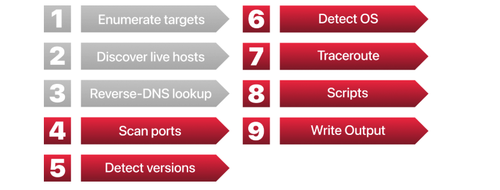

**Subnetworks**

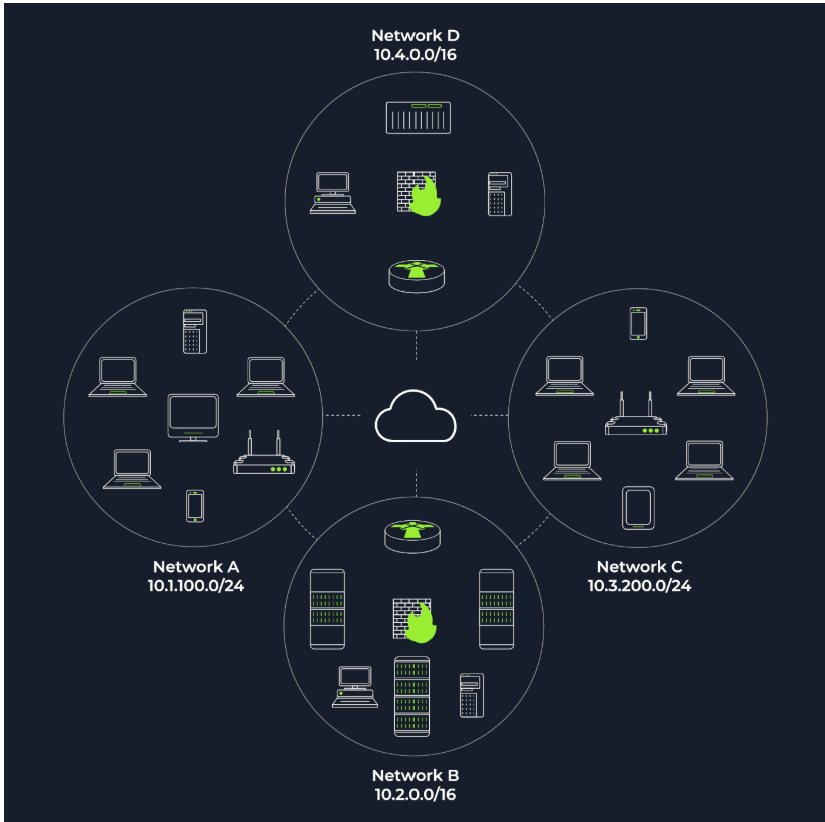

The figure above shows two types of subnets:

1. Subnets with /16, which means that the subnet mask can be written as 255.255.0.0. This subnet can accommodate around 65,000 hosts.
2. Subnets with /24, which indicates that the subnet mask can be expressed as 255.255.255.0. This subnet can have around 250 hosts.

Questions: 

1. How many devices can see the ARP Request? --> 4
2. Did computer6 receive the ARP Request? (yea/nay)--> nay
3. How many devices can see the ARP Request? --> 4
4. Did computer6 reply to the ARP Request? (yea/nay) --> yea

**NMAP BASIC PORT SCANS**

**TCP and UDP Ports**

A port is usually linked to a service using that specific port number. For instance, an HTTP server would bind to TCP port 80 by default; if it supports SSL/TLS, it would also listen on TCP port 443. (TCP ports 80 and 443 are the default ports for HTTP and HTTPS; however, the web server administrator might choose other port numbers if necessary.) Furthermore, no more than one service can listen on any TCP or UDP port (on the same IP address).

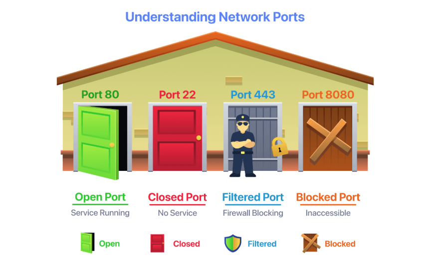

Ports can be classified into: 

1. An open port indicates that a service is listening on that port.
2. A closed port indicates that no service is listening on that port.

However, in practical situations, we need to consider the impact of firewalls. For instance, a port might be open, but a firewall might be blocking the packets. Therefore, Nmap considers the following six states:

1. An open port indicates that a service is listening on the specified port.
2. A closed port indicates that no service is listening on the specified port, although the port is accessible. By accessible, we mean that it is reachable and is not blocked by a firewall or other security appliances/programs.
3. Filtered means that Nmap cannot determine whether the port is open or closed because it is not accessible. This state is usually due to a firewall preventing Nmap from reaching that port. Nmap’s packets may be blocked from reaching the port; alternatively, responses may be blocked from reaching Nmap’s host.
4. Unfiltered means that Nmap cannot determine whether the port is open or closed, even though the port is accessible. This state is encountered when using an ACK scan -sA.
5. Open|Filtered: This means that Nmap cannot determine whether the port is open or filtered.
6. Closed|Filtered: This means that Nmap cannot decide whether a port is closed or filtered.

**Questions:**

Which service uses UDP port 53 by default? --> DNS
Which service uses TCP port 22 by default?--> SSH
How many port states does Nmap consider? --> 6
Which port state is the most interesting to discover as a pentester? --> Open

**TCP Flags**

Nmap supports different types of TCP Port Scans.

TCP Header Review

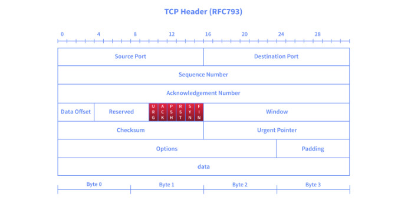

TCP Flags are captured in red in the below image:

1. URG: Urgent flag indicates that the urgent pointer field is significant. The urgent pointer indicates that the incoming data is urgent, and that a TCP segment with the URG flag set is processed immediately, without waiting for previously sent TCP segments.
2. ACK: Acknowledgement flag indicates that the acknowledgement number is significant. It is used to acknowledge the receipt of a TCP segment.
3. PSH: Push flag asking TCP to pass the data to the application promptly.
4. RST: The reset flag is used to reset the connection. Another device, such as a firewall, might send it to tear a TCP connection. This flag is also used when data is sent to a host, and there is no service on the receiving end to answer.
5. SYN: The synchronise flag is used to initiate a TCP 3-way handshake and synchronise sequence numbers with the other host. The sequence number should be set randomly during TCP connection establishment.
6. FIN: The sender has no more data to send.

Questions: 

What 3 letters represent the Reset flag?--> RST
Which flag needs to be set when you initiate a TCP connection (first packet of TCP 3-way handshake)?--> SYN

**TCP Connect Scan:**

TCP connect scan works by completing the TCP 3-way handshake. In standard TCP connection establishment, the client sends a TCP packet with the SYN flag set, and the server responds with SYN/ACK if the port is open; finally, the client completes the 3-way handshake by sending an ACK.

We are interested in learning whether the TCP port is open, not in establishing a TCP connection. Hence, the connection is torn as soon as its state is confirmed by sending a RST/ACK. You can choose to run a TCP connect scan using -sT.

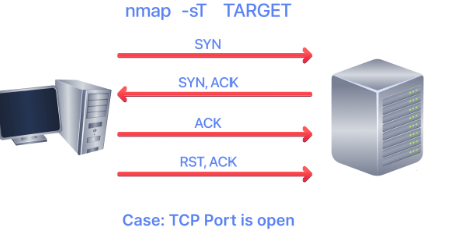

It is important to note that if you are not a privileged user (root or sudoer), a TCP connect scan is the only possible option to discover open TCP ports.

In the following Wireshark packet capture window, we see Nmap sending TCP packets with the SYN flag set to various ports, 5900, 22, 80, and so on. By default, Nmap will attempt to connect to the 1000 most common ports. A closed TCP port responds to a SYN packet with RST/ACK to indicate that it is not open. This pattern will repeat for all the closed ports as we attempt to initiate a TCP 3-way handshake with them.

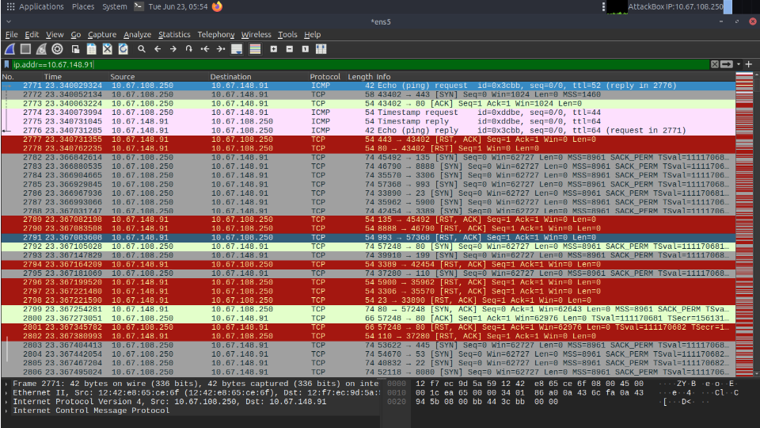

We notice that port 80 is open, so it replied with a SYN/ACK, and Nmap completed the 3-way handshake by sending an ACK. The figure below shows all the packets exchanged between our Nmap host and the target system’s port 80. The first three packets are the TCP 3-way handshake. Then the fourth packet tears it down with an RST/ACK.

Questions: 

What is the state of the FTP service running on port 21? --> Open
What is Nmap’s guess about the service running on port 53? --> domain

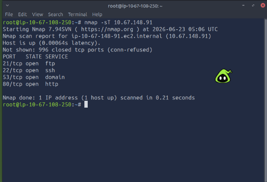

**TCP SYN Scan**

Unprivileged users are limited to the connect scan. However, the default scan mode is a SYN scan, and it requires a privileged (root or sudo) user to run. SYN scan does not need to complete the TCP 3-way handshake; instead, it tears down the connection after receiving a response from the server. Because we didn’t establish a TCP connection, the scan is less likely to be logged. We can select this scan type by using the -sS option. The figure below shows how the TCP SYN scan works without completing the TCP 3-way handshake.

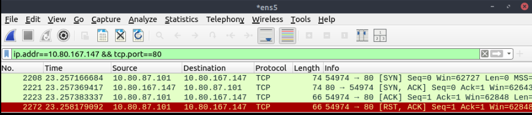

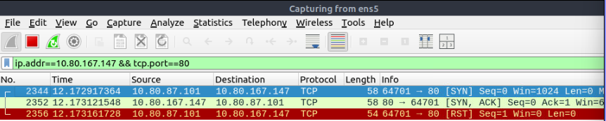

To better see the difference between the two scans, consider the following screenshot. In the upper half of the following figure, we can see TCP connect scan -sT traffic. Any open TCP port will require Nmap to complete the TCP 3-way handshake before closing the connection. In the lower half of the following figure, we see how a SYN scan -sS does not need to complete the TCP 3-way handshake; instead, Nmap sends an RST packet once a SYN/ACK packet is received.

Quesitons:

After launching a TCP SYN scan, how many SYN-ACK packets are successfully received in AttackBox? --> 4
How many ports are open on the target machine? --> 4

**UDP Scan**

UDP is a connectionless protocol; hence, it does not require a handshake for connection establishment. We cannot guarantee that a service listening on a UDP port would respond to our packets. However, if a UDP packet is sent to a closed port, an ICMP port unreachable error (type 3, code 3) is returned. You can select UDP scan using the -sU option; moreover, you can combine it with another TCP scan.

The following figure shows that if we send a UDP packet to an open UDP port, we cannot expect a reply. Therefore, sending a UDP packet to an open port won’t tell us anything.

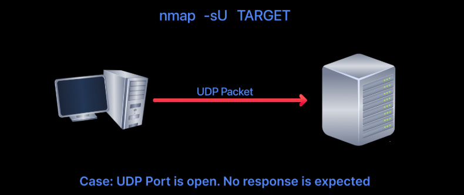

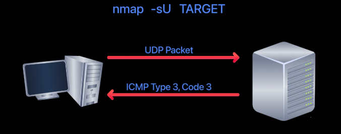

However, as shown in the figure above, we expect to receive an ICMP type 3, code 3, destination unreachable, port unreachable message. In other words, the UDP ports that don’t generate any response are the ones that Nmap will state as open.

In the Wireshark capture below, we can see that every closed port generates an ICMP destination unreachable (port unreachable) message.

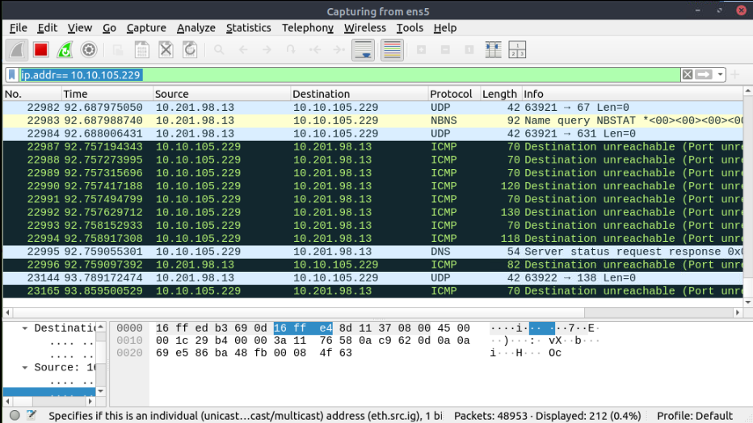

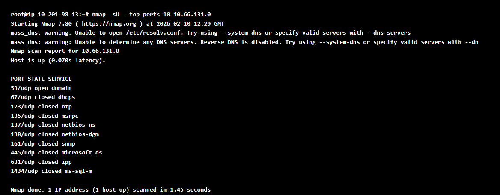

**Questions:**

What is the state of port number 161 over UDP in the target machine? --> Closed
What is the service name according to Nmap on port 161? --> snmp

**Fine-tuning scope and performances**

You can specify the ports you want to scan instead of the default 1000 ports. Specifying the ports is intuitive by now. Let’s see some examples: 

1. port list: -p22,80,443 will scan ports 22, 80 and 443.
2. port range: -p1-1023 will scan all ports between 1 and 1023 inclusive, while -p20-25 will scan ports between 20 and 25 inclusive.

You can request the scan of all ports by using -p-, which will scan all 65535 ports. If you want to scan the most common 100 ports, add -F. Using --top-ports 10 will check the ten most common ports.

You can control the scan timing using -T<0-5>. -T0 is the slowest (paranoid), while -T5 is the fastest. According to the Nmap manual page, there are six templates:

1. paranoid (0)
2. sneaky (1)
3. polite (2)
4. normal (3)
5. aggressive (4)
6. insane (5)

To avoid IDS alerts, you might consider -T0 or -T1. For instance, -T0 scans one port at a time and waits 5 minutes between sending each probe, so you can guess how long scanning one target would take to finish. If you don’t specify any timing, Nmap uses normal -T3. Note that -T5 is the most aggressive in terms of speed; however, this can affect the accuracy of the scan results due to the increased likelihood of packet loss. Note that -T4 is often used during CTFs and when learning to scan on practice targets, whereas -T1 is often used during real engagements where stealth is more important.

Alternatively, you can choose to control the packet rate using --min-rate <number> and --max-rate <number>. For example, --max-rate 10 or --max-rate=10 ensures that your scanner is not sending more than ten packets per second.

Moreover, you can control probing parallelisation using --min-parallelism <numprobes> and --max-parallelism <numprobes>. Nmap probes targets to discover which hosts are live and which ports are open; the probing parallelisation parameter specifies the number of such probes that can run in parallel. For instance, --min-parallelism=512 pushes Nmap to maintain at least 512 probes in parallel; these 512 probes are related to host discovery and open ports.

Control Parallelisation: Modify probe concurrency to balance speed and reliability.

Example: nmap -Pn --min-parallelism=512 --max-parallelism=1024 10.66.176.97

--min-parallelism forces a minimum number of probes
--max-parallelism caps concurrency
Higher values = faster scans but risk dropped packets

**Questions:**

What is the option to scan all the TCP ports between 5000 and 5500? --> -p5000-5500
How can you ensure that Nmap will run at least 64 probes in parallel? --> --min-parallelism=64
What option would you add to make Nmap very slow and paranoid? -T0

**Summary:**

This room covered three types of scans.

| Port Scan Type |	Example Command |
|----------------|-------------------|
|TCP Connect Scan	|nmap -sT 10.66.131.0|
| TCP SYN Scan	| sudo nmap -sS 10.66.131.0 |
| UDP Scan	| sudo nmap -sU 10.66.131.0 |

These scan types should get you started discovering running TCP and UDP services on a target host.

| Option |	Purpose |
|--------|----------|
| -p-	| all ports|
| -p1-1023|	scan ports 1 to 1023|
|-F	100 | most common ports|
| -r	| scan ports in consecutive order|
| -T<0-5> |	-T0 being the slowest and T5 the fastest|
| --max-rate 50	|rate <= 50 packets/sec|
| --min-rate 15	| rate >= 15 packets/sec| 
| --min-parallelism 100	| at least 100 probes in parallel |

**When to use NMAP Connect, sync or upd scan**

| Scan Type | Privileges Needed | Stealth | Speed | Best Use Case |
| --- | --- | --- | --- | --- |
| **TCP Connect (-sT)** | None | Low | Moderate | Reliable scans without root access |
| **TCP SYN (-sS)** | Root/Admin | High | Fast | Stealthy, large-scale port scans |
| **UDP (-sU)** | Root/Admin | Moderate | Slow | Detecting UDP services (DNS, SNMP) |

**NMAP Advanced Port Scans**

Advanced Port Scan

Types Null Scan - Send a TCP packet with no flags set to infer open ports from the lack of a response.
FIN Scan - Send a TCP packet with only the FIN flag to probe ports without initiating a connection.
Xmas Scan - Set FIN, PSH, and URG flags simultaneously to probe ports behind stateless firewalls.
Maimon Scan - Set FIN and ACK flags together to exploit a behaviour found in certain BSD-derived systems.
 ACK Scan - Send a packet with only the ACK flag to map firewall rules rather than discover open ports.
Window Scan - Examine the TCP Window field in RST responses to differentiate open from closed ports.
Custom Scan - Use --scanflags to craft your own TCP flag combinations for tailored probing.

Evasion and Spoofing Techniques

Spoofing IP - Forge the source IP address using -S so scan traffic appears to originate from a different host.
Spoofing MAC - Forge the source MAC address using --spoof-mac when on the same local network as the target.
Decoy Scan - Mix your real IP among multiple decoy addresses using -D to obscure the true scan source.
Fragmented Packets - Split packets into smaller IP fragments using -f or -ff to evade firewalls and IDS.
Idle/Zombie Scan - Use an idle third-party host with -sI to scan a target without revealing your own IP address.

**TCP NULL Scan**

The null scan does not set any flag, all six flag bits are set to zero. This scan can be used by using the filter -sN option. An TCP packet with no flags set will not trigger any response when it reaches an open port as shownn in the figure below.

Therefore, from Nmap’s perspective, a lack of reply in a null scan indicates that either the port is open or a firewall is blocking the packet.

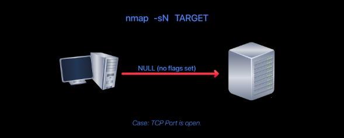

However, we expect the target server to respond with an RST packet if the port is closed. Consequently, we can use the lack of RST response to determine which ports are not closed: open or filtered.

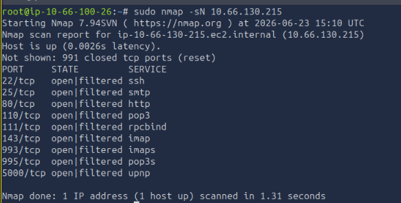

A Null Scan (-sN) in Nmap is a type of stealth TCP scan that sends packets with no flags set. It’s used in very specific scenarios where you want to probe systems quietly and potentially bypass simple filtering rules.

**FIN Scan**

The FIN scan sends a TCP packet with the FIN flag set. You can choose this scan type using the -sF option. Similarly, no response will be sent if the TCP port is open. Again, Nmap cannot be sure whether the port is open or whether a firewall is blocking traffic on this TCP port.

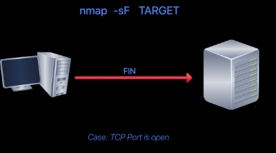

However, the target system should respond with an RST if the port is closed. Consequently, we will be able to identify which ports are closed and use this knowledge to infer which are open or filtered. It's worth noting that some firewalls will 'silently' drop the traffic without sending an RST.

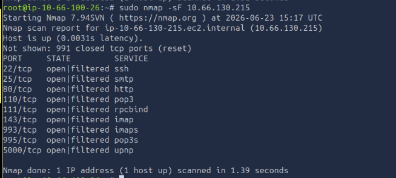

**Xmas Scan**

The Xmas scan gets its name from the Christmas tree lights. An Xmas scan sets the FIN, PSH, and URG flags simultaneously. You can select the Xmas scan with the option -sX.

As with the Null and FIN scans, receiving an RST packet indicates that the port is closed. Otherwise, it will be reported as open|filtered.

The following two figures show the cases when the TCP port is open and when it is closed.

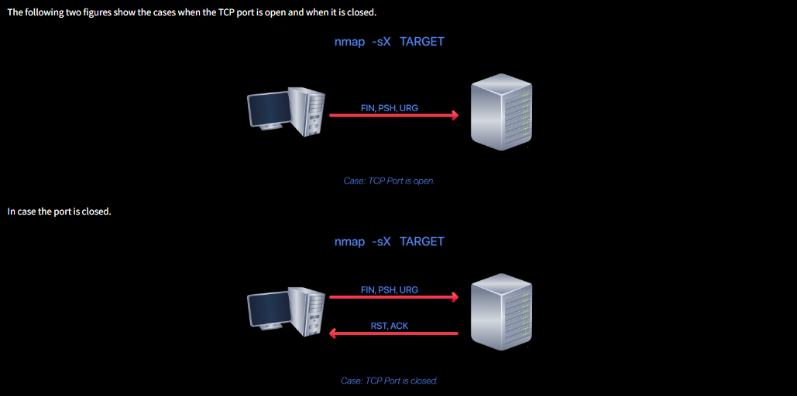

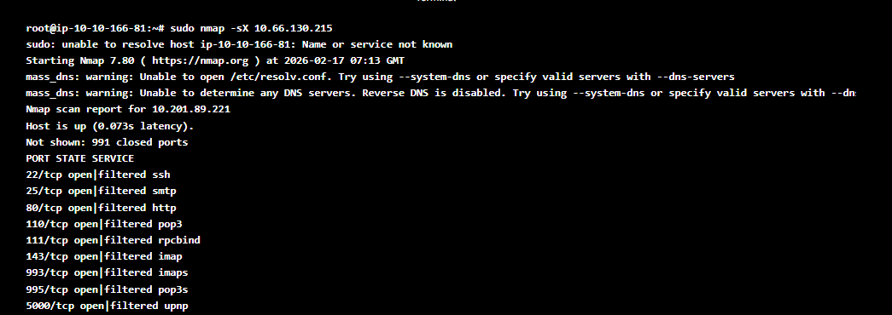

**Questions:**

In a null scan, how many flags are set to 1? -->0
In a FIN scan, how many flags are set to 1? --> 1
In a Xmas scan, how many flags are set to 1? --> 3
Launch a FIN scan against the target VM. How many ports appear as open|filtered? --> 9
Repeat your scan launching a null scan against the target VM. How many ports appear as open|filtered? --> 9

   

