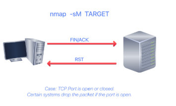
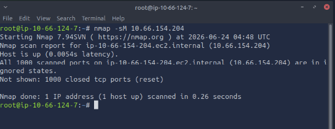
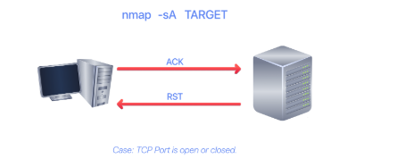
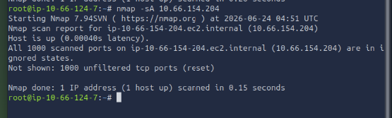
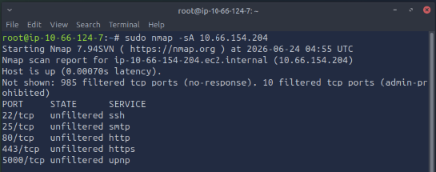
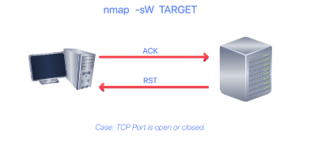
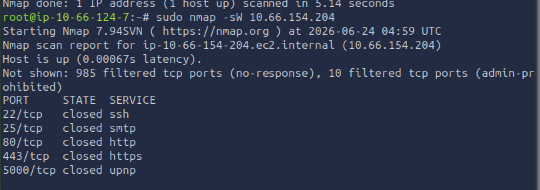
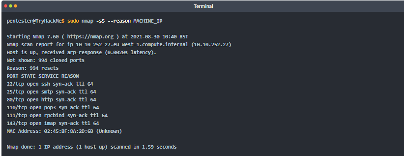

Nmap, short for Network Mapper, is free, open-source software released under the GPL license, created by Gordon Lyon (Fyodor), a network security expert and open-source programmer. Nmap is an industry-standard tool for mapping networks, identifying live hosts, and discovering running services. Nmap’s scripting engine can further extend its functionality, from fingerprinting services to exploiting vulnerabilities. A Nmap scan usually goes through the steps shown in the figure below, although many are optional and depend on the command-line arguments you provide.

**Subnetworks**

The figure above shows two types of subnets:

1. Subnets with /16, which means that the subnet mask can be written as 255.255.0.0. This subnet can accommodate around 65,000 hosts.
2. Subnets with /24, which indicates that the subnet mask can be expressed as 255.255.255.0. This subnet can have around 250 hosts.

Questions: 

1. How many devices can see the ARP Request? --> 4
2. Did computer6 receive the ARP Request? (yea/nay)--> nay
3. How many devices can see the ARP Request? --> 4
4. Did computer6 reply to the ARP Request? (yea/nay) --> yea

**NMAP BASIC PORT SCANS**

**TCP and UDP Ports**

A port is usually linked to a service using that specific port number. For instance, an HTTP server would bind to TCP port 80 by default; if it supports SSL/TLS, it would also listen on TCP port 443. (TCP ports 80 and 443 are the default ports for HTTP and HTTPS; however, the web server administrator might choose other port numbers if necessary.) Furthermore, no more than one service can listen on any TCP or UDP port (on the same IP address).

Ports can be classified into: 

1. An open port indicates that a service is listening on that port.
2. A closed port indicates that no service is listening on that port.

However, in practical situations, we need to consider the impact of firewalls. For instance, a port might be open, but a firewall might be blocking the packets. Therefore, Nmap considers the following six states:

1. An open port indicates that a service is listening on the specified port.
2. A closed port indicates that no service is listening on the specified port, although the port is accessible. By accessible, we mean that it is reachable and is not blocked by a firewall or other security appliances/programs.
3. Filtered means that Nmap cannot determine whether the port is open or closed because it is not accessible. This state is usually due to a firewall preventing Nmap from reaching that port. Nmap’s packets may be blocked from reaching the port; alternatively, responses may be blocked from reaching Nmap’s host.
4. Unfiltered means that Nmap cannot determine whether the port is open or closed, even though the port is accessible. This state is encountered when using an ACK scan -sA.
5. Open|Filtered: This means that Nmap cannot determine whether the port is open or filtered.
6. Closed|Filtered: This means that Nmap cannot decide whether a port is closed or filtered.

**Questions:**

Which service uses UDP port 53 by default? --> DNS
Which service uses TCP port 22 by default?--> SSH
How many port states does Nmap consider? --> 6
Which port state is the most interesting to discover as a pentester? --> Open

**TCP Flags**

Nmap supports different types of TCP Port Scans.

TCP Header Review

TCP Flags are captured in red in the below image:

1. URG: Urgent flag indicates that the urgent pointer field is significant. The urgent pointer indicates that the incoming data is urgent, and that a TCP segment with the URG flag set is processed immediately, without waiting for previously sent TCP segments.
2. ACK: Acknowledgement flag indicates that the acknowledgement number is significant. It is used to acknowledge the receipt of a TCP segment.
3. PSH: Push flag asking TCP to pass the data to the application promptly.
4. RST: The reset flag is used to reset the connection. Another device, such as a firewall, might send it to tear a TCP connection. This flag is also used when data is sent to a host, and there is no service on the receiving end to answer.
5. SYN: The synchronise flag is used to initiate a TCP 3-way handshake and synchronise sequence numbers with the other host. The sequence number should be set randomly during TCP connection establishment.
6. FIN: The sender has no more data to send.

Questions: 

What 3 letters represent the Reset flag?--> RST
Which flag needs to be set when you initiate a TCP connection (first packet of TCP 3-way handshake)?--> SYN

**TCP Connect Scan:**

TCP connect scan works by completing the TCP 3-way handshake. In standard TCP connection establishment, the client sends a TCP packet with the SYN flag set, and the server responds with SYN/ACK if the port is open; finally, the client completes the 3-way handshake by sending an ACK.

We are interested in learning whether the TCP port is open, not in establishing a TCP connection. Hence, the connection is torn as soon as its state is confirmed by sending a RST/ACK. You can choose to run a TCP connect scan using -sT.

It is important to note that if you are not a privileged user (root or sudoer), a TCP connect scan is the only possible option to discover open TCP ports.

In the following Wireshark packet capture window, we see Nmap sending TCP packets with the SYN flag set to various ports, 5900, 22, 80, and so on. By default, Nmap will attempt to connect to the 1000 most common ports. A closed TCP port responds to a SYN packet with RST/ACK to indicate that it is not open. This pattern will repeat for all the closed ports as we attempt to initiate a TCP 3-way handshake with them.

We notice that port 80 is open, so it replied with a SYN/ACK, and Nmap completed the 3-way handshake by sending an ACK. The figure below shows all the packets exchanged between our Nmap host and the target system’s port 80. The first three packets are the TCP 3-way handshake. Then the fourth packet tears it down with an RST/ACK.

Questions: 

What is the state of the FTP service running on port 21? --> Open
What is Nmap’s guess about the service running on port 53? --> domain

**TCP SYN Scan**

Unprivileged users are limited to the connect scan. However, the default scan mode is a SYN scan, and it requires a privileged (root or sudo) user to run. SYN scan does not need to complete the TCP 3-way handshake; instead, it tears down the connection after receiving a response from the server. Because we didn’t establish a TCP connection, the scan is less likely to be logged. We can select this scan type by using the -sS option. The figure below shows how the TCP SYN scan works without completing the TCP 3-way handshake.

To better see the difference between the two scans, consider the following screenshot. In the upper half of the following figure, we can see TCP connect scan -sT traffic. Any open TCP port will require Nmap to complete the TCP 3-way handshake before closing the connection. In the lower half of the following figure, we see how a SYN scan -sS does not need to complete the TCP 3-way handshake; instead, Nmap sends an RST packet once a SYN/ACK packet is received.

Quesitons:

After launching a TCP SYN scan, how many SYN-ACK packets are successfully received in AttackBox? --> 4
How many ports are open on the target machine? --> 4

**UDP Scan**

UDP is a connectionless protocol; hence, it does not require a handshake for connection establishment. We cannot guarantee that a service listening on a UDP port would respond to our packets. However, if a UDP packet is sent to a closed port, an ICMP port unreachable error (type 3, code 3) is returned. You can select UDP scan using the -sU option; moreover, you can combine it with another TCP scan.

The following figure shows that if we send a UDP packet to an open UDP port, we cannot expect a reply. Therefore, sending a UDP packet to an open port won’t tell us anything.

However, as shown in the figure above, we expect to receive an ICMP type 3, code 3, destination unreachable, port unreachable message. In other words, the UDP ports that don’t generate any response are the ones that Nmap will state as open.

In the Wireshark capture below, we can see that every closed port generates an ICMP destination unreachable (port unreachable) message.

**Questions:**

What is the state of port number 161 over UDP in the target machine? --> Closed
What is the service name according to Nmap on port 161? --> snmp

**Fine-tuning scope and performances**

You can specify the ports you want to scan instead of the default 1000 ports. Specifying the ports is intuitive by now. Let’s see some examples: 

1. port list: -p22,80,443 will scan ports 22, 80 and 443.
2. port range: -p1-1023 will scan all ports between 1 and 1023 inclusive, while -p20-25 will scan ports between 20 and 25 inclusive.

You can request the scan of all ports by using -p-, which will scan all 65535 ports. If you want to scan the most common 100 ports, add -F. Using --top-ports 10 will check the ten most common ports.

You can control the scan timing using -T<0-5>. -T0 is the slowest (paranoid), while -T5 is the fastest. According to the Nmap manual page, there are six templates:

1. paranoid (0)
2. sneaky (1)
3. polite (2)
4. normal (3)
5. aggressive (4)
6. insane (5)

To avoid IDS alerts, you might consider -T0 or -T1. For instance, -T0 scans one port at a time and waits 5 minutes between sending each probe, so you can guess how long scanning one target would take to finish. If you don’t specify any timing, Nmap uses normal -T3. Note that -T5 is the most aggressive in terms of speed; however, this can affect the accuracy of the scan results due to the increased likelihood of packet loss. Note that -T4 is often used during CTFs and when learning to scan on practice targets, whereas -T1 is often used during real engagements where stealth is more important.

Alternatively, you can choose to control the packet rate using --min-rate <number> and --max-rate <number>. For example, --max-rate 10 or --max-rate=10 ensures that your scanner is not sending more than ten packets per second.

Moreover, you can control probing parallelisation using --min-parallelism <numprobes> and --max-parallelism <numprobes>. Nmap probes targets to discover which hosts are live and which ports are open; the probing parallelisation parameter specifies the number of such probes that can run in parallel. For instance, --min-parallelism=512 pushes Nmap to maintain at least 512 probes in parallel; these 512 probes are related to host discovery and open ports.

Control Parallelisation: Modify probe concurrency to balance speed and reliability.

Example: nmap -Pn --min-parallelism=512 --max-parallelism=1024 10.66.176.97

--min-parallelism forces a minimum number of probes
--max-parallelism caps concurrency
Higher values = faster scans but risk dropped packets

**Questions:**

What is the option to scan all the TCP ports between 5000 and 5500? --> -p5000-5500
How can you ensure that Nmap will run at least 64 probes in parallel? --> --min-parallelism=64
What option would you add to make Nmap very slow and paranoid? -T0

**Summary:**

This room covered three types of scans.

| Port Scan Type |	Example Command |
|----------------|-------------------|
|TCP Connect Scan	|nmap -sT 10.66.131.0|
| TCP SYN Scan	| sudo nmap -sS 10.66.131.0 |
| UDP Scan	| sudo nmap -sU 10.66.131.0 |

These scan types should get you started discovering running TCP and UDP services on a target host.

| Option |	Purpose |
|--------|----------|
| -p-	| all ports|
| -p1-1023|	scan ports 1 to 1023|
|-F	100 | most common ports|
| -r	| scan ports in consecutive order|
| -T<0-5> |	-T0 being the slowest and T5 the fastest|
| --max-rate 50	|rate <= 50 packets/sec|
| --min-rate 15	| rate >= 15 packets/sec| 
| --min-parallelism 100	| at least 100 probes in parallel |

**When to use NMAP Connect, sync or upd scan**

| Scan Type | Privileges Needed | Stealth | Speed | Best Use Case |
| --- | --- | --- | --- | --- |
| **TCP Connect (-sT)** | None | Low | Moderate | Reliable scans without root access |
| **TCP SYN (-sS)** | Root/Admin | High | Fast | Stealthy, large-scale port scans |
| **UDP (-sU)** | Root/Admin | Moderate | Slow | Detecting UDP services (DNS, SNMP) |

**NMAP Advanced Port Scans**

Advanced Port Scan

Types Null Scan - Send a TCP packet with no flags set to infer open ports from the lack of a response.
FIN Scan - Send a TCP packet with only the FIN flag to probe ports without initiating a connection.
Xmas Scan - Set FIN, PSH, and URG flags simultaneously to probe ports behind stateless firewalls.
Maimon Scan - Set FIN and ACK flags together to exploit a behaviour found in certain BSD-derived systems.
 ACK Scan - Send a packet with only the ACK flag to map firewall rules rather than discover open ports.
Window Scan - Examine the TCP Window field in RST responses to differentiate open from closed ports.
Custom Scan - Use --scanflags to craft your own TCP flag combinations for tailored probing.

Evasion and Spoofing Techniques

Spoofing IP - Forge the source IP address using -S so scan traffic appears to originate from a different host.
Spoofing MAC - Forge the source MAC address using --spoof-mac when on the same local network as the target.
Decoy Scan - Mix your real IP among multiple decoy addresses using -D to obscure the true scan source.
Fragmented Packets - Split packets into smaller IP fragments using -f or -ff to evade firewalls and IDS.
Idle/Zombie Scan - Use an idle third-party host with -sI to scan a target without revealing your own IP address.

**TCP NULL Scan**

The null scan does not set any flag, all six flag bits are set to zero. This scan can be used by using the filter -sN option. An TCP packet with no flags set will not trigger any response when it reaches an open port as shownn in the figure below.

Therefore, from Nmap’s perspective, a lack of reply in a null scan indicates that either the port is open or a firewall is blocking the packet.

However, we expect the target server to respond with an RST packet if the port is closed. Consequently, we can use the lack of RST response to determine which ports are not closed: open or filtered.

A Null Scan (-sN) in Nmap is a type of stealth TCP scan that sends packets with no flags set. It’s used in very specific scenarios where you want to probe systems quietly and potentially bypass simple filtering rules.

**FIN Scan**

The FIN scan sends a TCP packet with the FIN flag set. You can choose this scan type using the -sF option. Similarly, no response will be sent if the TCP port is open. Again, Nmap cannot be sure whether the port is open or whether a firewall is blocking traffic on this TCP port.

However, the target system should respond with an RST if the port is closed. Consequently, we will be able to identify which ports are closed and use this knowledge to infer which are open or filtered. It's worth noting that some firewalls will 'silently' drop the traffic without sending an RST.

**Xmas Scan**

The Xmas scan gets its name from the Christmas tree lights. An Xmas scan sets the FIN, PSH, and URG flags simultaneously. You can select the Xmas scan with the option -sX.

As with the Null and FIN scans, receiving an RST packet indicates that the port is closed. Otherwise, it will be reported as open|filtered.

The following two figures show the cases when the TCP port is open and when it is closed.

**Questions:**

In a null scan, how many flags are set to 1? -->0
In a FIN scan, how many flags are set to 1? --> 1
In a Xmas scan, how many flags are set to 1? --> 3
Launch a FIN scan against the target VM. How many ports appear as open|filtered? --> 9
Repeat your scan launching a null scan against the target VM. How many ports appear as open|filtered? --> 9

**TCP Maimon Scan**

Uriel Maimon first described this scan in 1996. In this scan, the FIN and ACK bits are set. The target should send an RST packet as a response. However, certain BSD-derived systems drop the packet if it is an open port exposing the open ports. This scan won’t work on most targets encountered in modern networks; however, we include it in this room to better understand the port scanning mechanism and the hacking mindset. To select this scan type, use the -sM option.

Most target systems respond with an RST packet regardless of whether the TCP port is open. In such a case, we won’t be able to discover the open ports. The figure below shows the expected behaviour for both open and closed TCP ports.

**Questions:**

In the Maimon scan, how many flags are set? --> 2

**TCP,ACK, Window and Custom Scan**

**TCP ACK Scan**

Let’s start with the TCP ACK scan. As the name implies, an ACK scan will send a TCP packet with the ACK flag set. Use the -sA  option to choose this scan. As shown in the figure below, the target would respond to the ACK with RST regardless of the port's state. This behaviour occurs because a TCP packet with the ACK flag set should be sent only in response to a received TCP packet to acknowledge receipt of data, unlike in our case. Hence, this scan won’t tell us whether the target port is open in a simple setup.

This kind of scan would be helpful if a firewall were in front of the target. Consequently, based on which ACK packets resulted in responses, you will learn which ports were not blocked by the firewall. In other words, this type of scan is better suited to discovering firewall rule sets and configurations.

Visit the URL http://10.66.154.204:5000 to activate the firewall, and we will repeat the scan.

This time, we received some interesting results. As shown in the console output below, the firewall is blocking all other ports except these five.

**Windows Scan**

Another similar scan is the TCP window scan. The TCP window scan is almost identical to the ACK scan; however, it examines the TCP Window field of the RST packets returned. On specific systems, this can reveal that the port is open. You can select this scan type with the option -sW. As shown in the figure below, we expect to get an RST packet in reply to our “uninvited” ACK packets, regardless of whether the port is open or closed.

Similarly, launching a TCP window scan against a Linux system without a firewall will not yield much information.

However, as you would expect, if we repeat our TCP window scan against a server behind a firewall, we expect to get more satisfying results. In the console output shown below, the TCP window scan identified five ports as closed. (This is in contrast with the ACK scan, which labelled the same five ports as unfiltered.) Although we know that these five ports are not closed, we realise they responded differently, indicating that the firewall does not block them.

**Custom Scan**

If you want to experiment with a new TCP flag combination beyond the built-in TCP scan types, you can do so using --scanflags. For instance, if you want to set SYN, RST, and FIN simultaneously, you can do so using --scanflags RSTSYNFIN. As shown in the figure below, if you develop your own custom scan, you need to understand how the different ports will behave to correctly interpret the results in different scenarios.

Finally, it is essential to note that the ACK and window scans were highly effective in helping us map the firewall rules. However, it is vital to remember that just because a firewall is not blocking a specific port, it does not necessarily mean that a service is listening on that port. For example, the firewall rules may need to be updated to reflect recent service changes. Hence, ACK and window scans are exposing the firewall rules, not the services.

Questions: 

1. In TCP Window scan, how many flags are set? --> 1
2. You decided to experiment with a custom TCP scan that has the reset flag set. What would you add after --scanflags? --> RST
3. Launch an ACK scan against the target VM with the firewall enabled. How many ports appear unfiltered? --> 5
4. What is the new port number that appeared? To determine the new port you need to compare the scan results of Task 2 to the ones of this task. --> 443
5. Is there any service behind the newly discovered port number? (yea/nay) --> yea

**Spoofing and Decoys:**

In some network setups, you will be able to scan a target system using a spoofed IP address and even a spoofed MAC address. Such a scan is only beneficial when you can guarantee that you will capture the response. If you try to scan a target from some random network using a spoofed IP address, chances are you won’t have any response routed to you, and the scan results could be unreliable.

In some network setups, you will be able to scan a target system using a spoofed IP address and even a spoofed MAC address. Such a scan is only beneficial when you can guarantee that you will capture the response. If you try to scan a target from some random network using a spoofed IP address, chances are you won’t have any response routed to you, and the scan results could be unreliable.

In brief, scanning with a spoofed IP address is three steps:

The attacker sends a packet with a spoofed source IP address to the lab machine.
The lab machine replies to the spoofed IP address as the destination.
The attacker captures replies to identify open ports.

In general, you expect to specify the network interface using -e and to explicitly disable ping scan -Pn. Therefore, instead of nmap -S SPOOFED_IP 10.66.154.204, you will need to issue nmap -e NET_INTERFACE -Pn -S SPOOFED_IP 10.66.154.204 to tell Nmap explicitly which network interface to use and not to expect to receive a ping reply. It is worth repeating that this scan will be useless if the attacker's system cannot monitor the network for responses.

-e is used to force Nmap to send spoofed packets through the correct network path, since spoofing bypasses normal OS decision-making.

When you are on the same subnet as the lab machine, you can spoof your MAC address as well. You can specify the source MAC address using --spoof-mac SPOOFED_MAC. This address spoofing is only possible if the attacker and the lab machine are on the same Ethernet (802.3) network or the same WiFi (802.11).

Spoofing only works in a minimal number of cases where certain conditions are met. Therefore, the attacker might resort to decoys to make it harder to pinpoint. The concept is simple: make the scan appear to originate from many IP addresses so that the attacker’s IP address is lost among them. As shown in the figure below, the scan of the lab machine will appear to come from 3 different sources, and consequently, the replies will go to the decoys as well.

You can launch a decoy scan by specifying a specific or random IP address after -D. For example, nmap -D 10.10.0.1,10.10.0.2,ME 10.66.154.204 will make the scan of 10.66.154.204 appear as coming from the IP addresses 10.10.0.1, 10.10.0.2, and then ME to indicate that your IP address should appear in the third order. Another example command would be nmap -D 10.10.0.1,10.10.0.2,RND,RND,ME 10.66.154.204, where the third and fourth source IP addresses are assigned randomly, while the fifth source is going to be the attacker’s IP address. In other words, each time you execute the latter command, you would expect two new random IP addresses to be the third and fourth decoy sources.

**Questions**

1. What do you need to add to the command sudo nmap 10.66.154.204 to make the scan appear as if coming from the source IP address 10.10.10.11 instead of your IP address?--> -S 10.10.10.11
2. What do you need to add to the command sudo nmap 10.66.154.204 to make the scan appear as if coming from the source IP addresses 10.10.20.21 and 10.10.20.28 in addition to your IP address? --> -D 10.10.20.21,10.10.20.28, ME

**Fragmented Packets**

Firewall: A firewall is a piece of software or hardware that either permits or blocks packets. It functions based on firewall rules, summarised as blocking all traffic with exceptions or allowing all traffic with exceptions. For instance, you might block all traffic to your server except that coming to your web server. A traditional firewall inspects at least the IP and transport layer headers. A more sophisticated firewall would also try to examine the data carried by the transport layer.

**IDS**

An Intrusion Detection System (IDS) inspects network packets for select behavioural patterns or specific content signatures. It raises an alert whenever a malicious rule is met. In addition to the IP and transport layer headers, an IDS would inspect the transport layer data and check whether it matches any malicious patterns. How can you make it less likely for a traditional firewall/IDS to detect your Nmap activity? It is not easy to answer this; however, depending on the type of firewall/IDS, you might benefit from dividing the packet into smaller packets.

**Fragmented Packets**

Nmap provides the option -f to fragment packets. Once chosen, the IP data will be divided into 8 bytes or fewer. Adding another -f (-f -f or -ff) will split the data into 16 byte-fragments instead of 8. You can change the default value by using the --mtu; however, you should always choose a multiple of 8.

To understand fragmentation, we need to examine the IP Header shown in the figure below. The source IP Addresses occupies 32 bits (4 bytes) on the fourth row, while destination occupies another 4 bytes on the fifth row. The data that we will fragment accross multiple packets is highlited in red.

In the AB, execute the command wireshark to capture the dump and enter the command sudo nmap -sS -p80 -f 10.66.154.204. As you know by now, this will use a stealth TCP SYN scan on port 80 and request that Nmap fragment IP packets.

With fragmentation requested via -f, the 24 bytes of the TCP header will be divided into multiples of 8 bytes, with the last fragment containing 8 bytes or fewer of the TCP header. Since 24 is divisible by 8, we get 3 IP fragments; each has a 20-byte IP header and an 8-byte TCP header. We can see the three fragments between the fifth and the seventh lines. 

Note that if you added -ff (or -f -f), the data will be fragmented into multiples of 16. In other words, the 24 bytes of the TCP header, in this case, would be divided over two IP fragments, the first containing 16 bytes and the second containing 8 bytes of the TCP header.

On the other hand, if you prefer to increase the size of your packets to make them look innocuous, you can use the option --data-length NUM, where num specifies the number of bytes you want to append to your packets.

**Questions**

If the TCP segment has a size of 64, and the -ff option is being used, how many IP fragments will you get? --> 4

**IDLE/ Zombie Scans**

Spoofing the source IP address can be an effective way to conduct stealthy scans. However, spoofing will only work in specific network setups. It requires you to be in a position to monitor traffic. Considering these limitations, spoofing your IP address is unlikely to be useful; however, we can give it a boost with the idle scan.

The idle scan, or zombie scan, requires an idle system connected to the network that you can communicate with. Practically, Nmap will make each probe appear to come from the idle (zombie) host, then check whether the idle (zombie) host received any response to the spoofed probe. This is accomplished by checking the IP identification (IP ID) value in the IP header. You can run an idle scan using nmap -sI ZOMBIE_IP MACHINE_IP, where ZOMBIE_IP is the IP address of the idle host (zombie).

The idle (zombie) scan requires the following three steps to discover whether a port is open:

1. Trigger the idle host to respond so that you can record the current IP ID on the idle host.
2. Send a SYN packet to a TCP port on the target. The packet should be spoofed to appear to come from the idle host's IP address (zombie).
3. Trigger the idle machine again to respond so that you can compare the new IP ID with the one received earlier.

we have the attacker system probing an idle machine, a multi-function printer. By sending a SYN/ACK, it responds with an RST packet containing its newly incremented IP ID.

The attacker will send a SYN packet to the TCP port they want to check on the lab machine in the next step. However, this packet will use the idle host (zombie) IP address as the source. Three scenarios would arise. In the first scenario the TCP port is closed; therefore, the lab machine responds to the idle host with an RST packet. The idle host does not respond; hence, its IP ID is not incremented.

In the second scenario, the TCP port is open, so the lab machine responds to the idle host (zombie) with a SYN/ACK. The idle host responds to this unexpected packet with an RST, incrementing its IP ID.

In the third scenario, the lab machine does not respond at all due to firewall rules. This lack of response will result in the same outcome as with a closed port: the idle host won’t increment the IP ID.

For the final step, the attacker sends another SYN/ACK to the idle host. The idle host responds with an RST packet, incrementing the IP ID by one again. The attacker needs to compare the IP ID of the RST packet received in the first step with the IP ID of the RST packet received in this third step. If the difference is 1, it means the port on the lab machine was closed or filtered. However, if the difference is 2, it means that the port on the target was open.

It is worth repeating that this scan is called an idle scan because selecting an idle host is essential to its accuracy. If the “idle host” is busy, all the returned IP IDs would be useless.

Questions: 

You discovered a rarely-used network printer with the IP address 10.10.5.5, and you decide to use it as a zombie in your idle scan. What argument should you add to your Nmap command? --> -sI 10.10.5.5

**Getting more details**

You might consider adding --reason if you want Nmap to provide more details regarding its reasoning and conclusions. Consider the two scans below to the system; however, the latter adds --reason.

Providing the --reason flag gives us the explicit reason why Nmap concluded that the system is up or a particular port is open. In the console output above, we can see that this system is considered online because Nmap “received arp-response.” On the other hand, we know the SSH port is open because Nmap received a “syn-ack” packet.

For more detailed output, you can consider using -v for verbose output or -vv for even more verbosity.

If -vv does not satisfy your curiosity, you can use -d for debugging details or -dd for even more details. You can guarantee that using -d will create an output that extends beyond a single screen.

**Questions:**

Use Nmap with nmap -sS -F --reason MACHINE_IP to scan the VM. What is the reason provided for the stated port(s) being open? --> syn-ack

**Summary**

This room covered the following types of scans.

| Port Scan Type | Example Command |
|----------------|-----------------|
|TCP Null Scan	| sudo nmap -sN MACHINE_IP |
| TCP FIN Scan	| sudo nmap -sF MACHINE_IP |
| TCP Xmas Scan	| sudo nmap -sX MACHINE_IP |
|T CP Maimon Scan	| sudo nmap -sM MACHINE_IP|
| TCP ACK Scan	|sudo nmap -sA MACHINE_IP|
| TCP Window Scan	| sudo nmap -sW MACHINE_IP|
| Custom TCP Scan	| sudo nmap --scanflags URGACKPSHRSTSYNFIN MACHINE_IP |
| Spoofed Source IP	| sudo nmap -S SPOOFED_IP MACHINE_IP|
|Spoofed MAC Address	|--spoof-mac SPOOFED_MAC|
| Decoy Scan	nmap | -D DECOY_IP,ME MACHINE_IP |
| Idle (Zombie) Scan	| sudo nmap -sI ZOMBIE_IP MACHINE_IP| 
| Fragment IP data into 8 bytes |	-f |
| Fragment IP data into 16 bytes |	-ff |

| Option	| Purpose |
|--------|---------|
| --source-port PORT_NUM	| Specify source port number |
|--data-length NUM	| Append random data to reach the given length| 

These scan types rely on setting TCP flags in unexpected ways to prompt ports for a reply. Null, FIN, and Xmas scans provoke a response from closed ports, while Maimon, ACK, and Window scans provoke a response from open and closed ports.

| Option |	Purpose |
| --reason	| explains how Nmap made its conclusion |
|-v	| verbose|
| -vv	| very verbose|
|-d	|debugging|
|-dd	|more details for debugging|

**Type of Scans and when to use.**

| **Type / Option**                          | **When to Use**                       | **Reason / Purpose**                                     |
| ------------------------------------------ | ------------------------------------- | -------------------------------------------------------- |
| **TCP SYN Scan (-sS)**                     | Default scan with root access         | Fast, reliable, half-open → stealthier than full connect |
| **TCP Connect Scan (-sT)**                 | No root privileges                    | Uses full handshake → more detectable but universal      |
| **TCP Null Scan (-sN)**                    | Firewall evasion (Linux/Unix targets) | No flags set → helps identify open/filtered ports        |
| **TCP FIN Scan (-sF)**                     | Bypass simple firewalls               | FIN packet avoids some filters                           |
| **TCP Xmas Scan (-sX)**                    | Stealth scan alternative              | Sends FIN+URG+PSH → useful for evasion testing           |
| **TCP Maimon Scan (-sM)**                  | Testing BSD/rare TCP behavior         | Exploits unusual FIN/ACK responses                       |
| **TCP ACK Scan (-sA)**                     | Firewall rule mapping                 | Identifies filtered vs unfiltered ports (not open ports) |
| **TCP Window Scan (-sW)**                  | When ACK scan is inconclusive         | Uses window size differences to detect open ports        |
| **Custom Scan (--scanflags)**              | Advanced IDS/firewall testing         | Craft custom TCP flags → simulate attack patterns        |
| **UDP Scan (-sU)**                         | Check UDP services (DNS, SNMP)        | Finds UDP-based services (slow, often filtered)          |
| **Ping Scan (-sn)**                        | Host discovery only                   | Finds live hosts without port scanning                   |
| **Service Detection (-sV)**                | Enumeration phase                     | Identifies service versions for vulnerability analysis   |
| **OS Detection (-O)**                      | Identify target OS                    | Helps in system fingerprinting                           |
| **Aggressive Scan (-A)**                   | Full reconnaissance                   | Combines OS, version detection, scripts, traceroute      |
| **Decoy Scan (-D)**                        | Hide real source IP                   | Mixes fake IPs → confuses IDS attribution                |
| **Idle Scan (-sI)**                        | Full anonymity                        | Uses zombie host → completely stealthy                   |
| **Spoofed IP (-S)**                        | Test trust relationships              | Pretends to be another host (no response back easily)    |
| **Spoofed MAC (--spoof-mac)**              | Bypass MAC filtering (LAN)            | Evades NAC / MAC-based controls                          |
| **Fragment Packets (-f / -ff)**            | Bypass IDS/firewalls                  | Splits packets → may evade detection                     |
| **Timing Templates (-T0–T5)**              | Control speed vs stealth              | T0 slow/stealthy → T5 fast/noisy                         |
| **Rate Control (--min-rate / --max-rate)** | Tune scan performance                 | Avoid IDS or speed up scanning                           |
| **Retries (--max-retries)**                | Slow/unreliable networks              | Reduce retries to speed up scans                         |
| **Scan Delay (--scan-delay)**              | Avoid detection                       | Adds delay between packets                               |
| **Verbose (-v / -vv)**                     | Debugging scans                       | Shows detailed output                                    |
| **Output (-oN / -oX / -oG)**               | Reporting & logging                   | Saves results in different formats                       |
| **Script Scan (-sC / --script)**           | Deep enumeration                      | Runs NSE scripts for vuln detection                      |
| **Traceroute (--traceroute)**              | Network path analysis                 | Shows route to target                                    |

   

