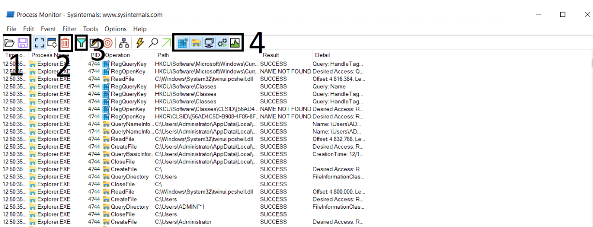
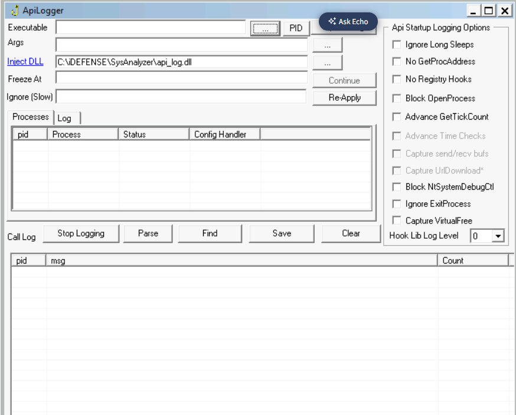
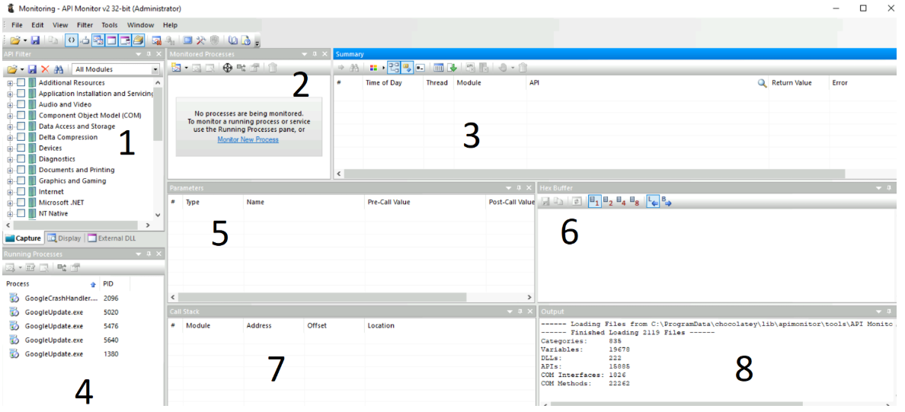
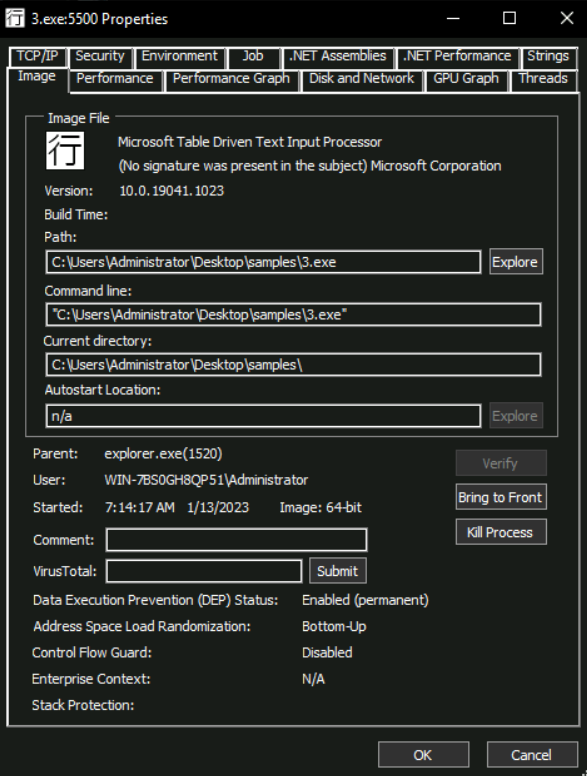
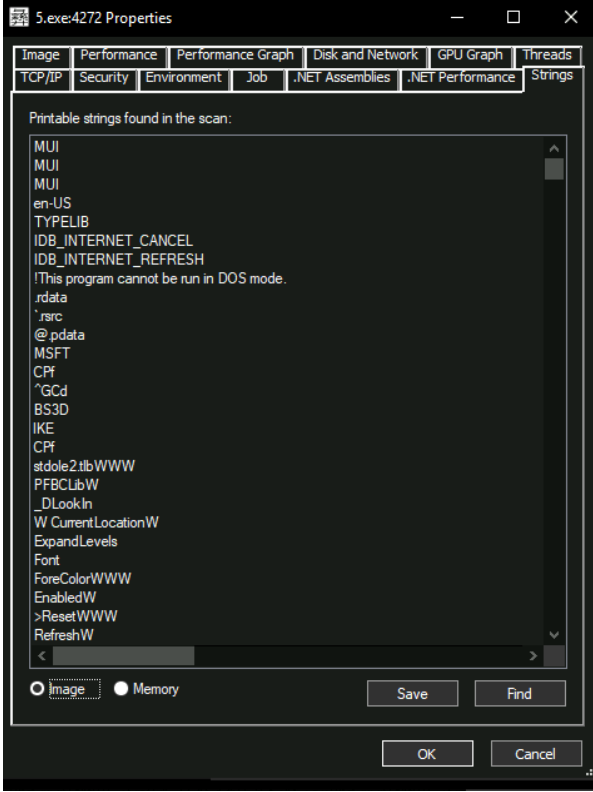

**Setup Required to Create a Sandbox**

1. An isolated machine, ideally a virtual machine, that is not connected to live or production systems and is dedicated to malware analysis.
2. The ability of the isolated or virtual machine to save its initial clean state and revert to that state once malware analysis is complete. This functionality is often called creating and reverting a snapshot. We will need to revert to the original clean state before analyzing a new malware so that infection from the previous malware doesn't contaminate the analysis of the next one.
3. Monitoring tools that help us analyze the malware while it's executing inside the Virtual Machine. These tools can be automated, as we see in automated sandboxes, or they can be manual, requiring the analyst to interact while performing analysis. We will learn about some of these tools later in the room.
4. A file-sharing mechanism that can be used to introduce the malware into the Virtual Machine and sends the analysis data or reports out to us. Often, shared directories or network drives are used for this purpose. However, we must be careful that the shared directory is unmounted when executing the malware, as the malware might infect all the files. This is especially true of ransomware, which might encrypt all shared drives or directories.

  
**Analysis Tools:**

**File Sharing**

1. Shared Folder
2. Creating an iso in the host and mounting it to the VM
3. Clipboard copy and paser

**Promon:**

1. Shows the Open and Save options. These options are for opening a file that contains ProcMon events or saving the events to a supported file.
2. Shows the Clear option. This option clears all the events currently being shown by ProcMon. It is good to clear the events once we execute a malware sample of interest to reduce noise.
3. Shows the Filter option, which gives us further control over the events shown in the ProcMon window.
4. These are toggles to turn off or on Registry, FileSystem, Network, Process/Thread, and Profiling events

**API Logger And Monitor**

API - Application Programmable Interface

The Windows OS abstracts the hardware and provides an Application Programmable Interface (API) for performing all tasks. For example, there is an API for creating files, an API for creating processes, an API for creating and deleting registries and so on. Therefore, one way to identify malware behaviour is to monitor which APIs a malware calls. The names of the APIs are generally self-explanatory.

**API LOGGER**

The API Logger is a simple tool that provides basic information about APIs called by a process. 

To open a new process, we can click the highlighted three-dot menu. When clicked, a file browser allows us to select the executable for which we want to monitor the API calls. Once we select the executable, we can click 'Inject & Log' to start the API logging process.

**API Monitor**

API Monitor provides more advanced information about a process's API Calls.

1. This tab is a filter for the API group we want to monitor. For example, we have a group for 'Graphics and Gaming' related APIs, another for 'Internet' related APIs and so on. API Monitor will only show us APIs from the group we select from this menu.
2. This tab shows the processes being monitored for API calls. We can click the 'Monitor New Process' option to start monitoring a new process.
3. This tab shows the API call, the Module, the Thread, Time, Return Value, and any errors. We can monitor this tab for APIs called by a process.
4. This tab shows running processes that API Monitor can monitor.
5. This tab shows the Parameters of the API call, including the values of those Parameters before and after the API calls.
6. This tab shows the Hex buffer of the selected value.
7. This tab shows the Call Stack of the process.
8. Finally, this tab shows the Output.

Process Explorer

Process Explorer is another very useful tool from the Sysinternals Suite. It can be considered a more advanced form of the Windows Task Manager. Process Explorer is a very powerful tool that can help us identify process hollowing and masquerading techniques.

Process Masquerading:

Malware authors sometimes use process names similar to Windows processes or commonly used software to hide from an analyst's prying eyes.

 The 'Image' tab, as shown in the above screenshot, helps an analyst defeat this technique. By clicking the 'Verify' button on this tab, an analyst can identify if the executable for the running process is signed by the relevant organization, which will be Microsoft in the case of Windows binaries.

Process Hollowing:

Another technique used by malware to hide in plain sight is Process Hollowing. In this technique, the malware binary hollows an already running legitimate process by removing all its code from its memory and injecting malicious code in place of the legitimate code.

At the bottom of the screenshot, we can see the options 'Image' and 'Memory'. When we select 'Image', Process Explorer shows us strings present in the disk image of the process. When 'Memory' is selected, Process Explorer extracts strings from the process's memory. In normal circumstances, the strings in the Image of a process will be similar to those in the Memory as the same process is loaded in the memory. However, if a  process has been hollowed, we will see a significant difference between the strings in the Image and the process's memory. Hence showing us that the process loaded in the memory is vastly different from the process stored on the disk.

