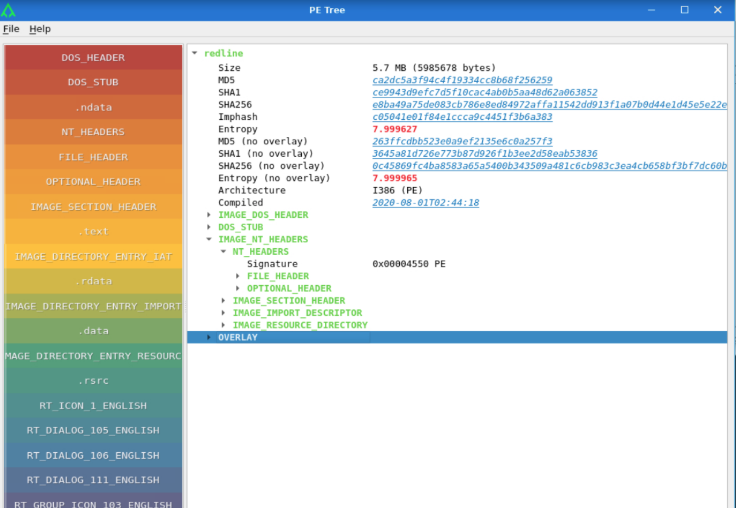
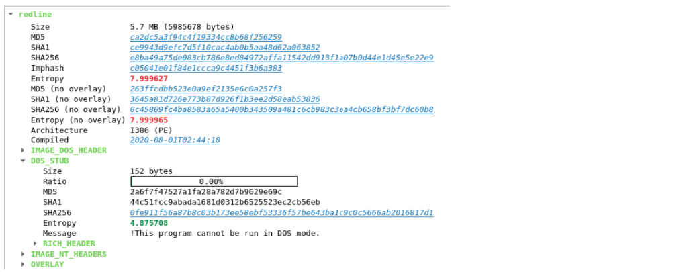
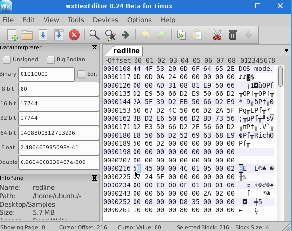
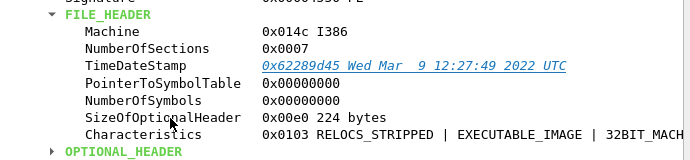
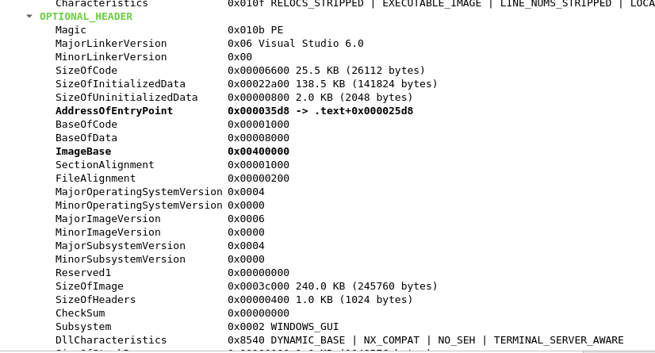

On disk, a PE executable looks the same as any other form of digital data, i.e., a combination of bits. If we open a PE file in a Hex editor, we will see a random bunch of Hex characters. This bunch of Hex characters are the instructions a Windows OS needs to execute this binary file.

Tools Used:

1. WxHexEditor Utitlity
2. pe-tree

Every executable PE Header Hirearchy is as below :

1. IMAGE_DOS_HEADER
2. IMAGE_NT_HEADERS
  a. FILE_HEADER
  b. OPTIONAL_HEADER
  c. IMAGE_SECTION_HEADER
  d. IMAGE_IMPORT_DESCRIPTOR

All of these Headers are of the data type STRUCT. A Struck is a user defined data type that combines several different types of data elements in a Single Variable.

OR 

⭐ STRUCT is a custom data type that lets you group different variables together inside one block of memory.

Explaination of PE Headers

1. **IMAGE_DOS_HEADER And DOS_STUB:** The IMAGE_DOS_HEADER consists of the first 64 bytes of the PE File.

The first two bytes that say 4D 5A - translates to MZ character in ASCII. The MZ character denote the intiatials of Mark Zbikowski. The MZ Character are an identiifer of the Portable Executable Format. When these two bytes are present in the start of the file , the Windows OS considers it as a Portable Executable Format file.

The first entry in the IMAGE_DOS_HEADER dropdown menu, it says e_magic and has a value of 0x5a4d MZ - which says its a windows executable.
The Last value in the IMAGE_DOS_HEADER dropdown menu - it says e_lfanew and it has a value of 0x000000d8. This denotes the address from where the IMAGE_NT_HEADERS start. Therefore in the PE File - the IMAGE_NT_HEADERS start from the address 0x000000d8.

The DOS Stub contains the message !This Program cannot be run in DOS MODE. Please note that the size, hashes, and Entropy shown here by pe-tree are not related to the PE file; instead, it is for the particular section we are analyzing. These values are calculated based on the data in a specific header and are not included.

Entropy mentioned in the image is the amount of randomness found in data. The Higher Value of Entropy the more random the data is.

The DOS STUB is a small piece of code that only runs if the PE file is incompatible with the system it is being run on. It displays the message mentioned above. For example, since this PE file we are examining is a Windows executable, if it is run in MS-DOS, the PE file will exit after showing the message in the DOS STUB. 

**IMAGE_NT_HEADERS:** This header contains most of the vital information related to the PE File.

The NT_HEADERS consist of the following 

- Signature
- File Header
- Optional Header

The Starting address of the IMAGE_NT_HEADERS is found in e_lfanew from the IMAGE_DOS_HEADE.
For Example in the redline sample - We see that the address was 0x000000D8 is from where the IMAGE_NT_HEADERS start, in HEX EDITOR - Try CTRL+G to go to an OFFSET. Make sure the select From beginning in type of branch option at the bottom and Data type is set to HEX.

**Signature:** The first 4 bytes of the NT_HEADERS consist of the signature, We can See this as the bytes 50 45 00 00 in HEX or the chracters PE in ASCII as shown in HEX editor.

The signature denotes the start of the NT_Header. Apart from the signatur, the NT_header contains the FILE_Header and the IMAGE_OPTIONAL_HEADER.

**FILE_HEADER:** This Header contains some vital information.

As the above screenshot, it contains the following fields

Machine: This field mentions the type of architecture for which the PE file is written. In the above example the architecture is mentioned as i386 which means that the PE file is compatible with 32-bit Intel architecture. Similarly for 64 bit the architecture will be mentioned as AMD64.

Number of Sections: A PE file contains different sections where code, variables and other resources are stored. This tells us about Number of sections are present in the PE Header. In this example - the number of sections in this scenario has 7 sections.

TimeDateStamp: This field contains the time and date of the binary Compliation.

PointerToSymbol and NumberofSymbos - These fields are not generally related to PE files, Instead they are related to COFF File Headers

Size of Optional Header : Mentioned further in the document.

Characteristics :  In our case, this field tells us that the PE file has stripped relocation information, line numbers, and local symbol information. It is an executable image and compatible with a 32-bit machine.

**Optional_Header**

This section contains one of the most important information present in the PE Headers. In Hex Editor the Optional Header Starts right after the end of the FILE_Header.

Critical Fields in Optional Header

1. Magic : The Magic Number tells wheather the PE file is a 32 bit or 64 bit application. If the value value is 0x010B, it denotes a 32-bit application; if the value is 0x020B, it represents a 64-bit application.
2. AddressOFEntryPoint: This field is significant from a malware analysis point of view. This is where from where the windows will start the execution point.  In other words, the first instruction to be executed is present at this address. This is a Relative Virtual Address (RVA), meaning it is at an offset relative to the base address of the image (ImageBase) once loaded into memory.
3. BaseOfCode and BaseOfData: These are the addresses of the code and data sections, respectively, relative to ImageBase.
4. ImageBase: The ImageBase is the preferred loading address of the PE file in memory. Generally, the ImageBase for .exe files is 0x00400000, which is also the case for our PE file. Since Windows can't load all PE files at this preferred address, some relocations are in order when the file is loaded in memory. These relocations are then performed relative to the ImageBase.
5. Subsystem: This represents the Subsystem required to run the image. The Subsystem can be Windows Native, GUI (Graphical User Interface), CUI (Commandline User Interface), or some other Subsystem. The screenshot above from the pe-tree utility shows that the Subsystem is 0x0002, representing Windows GUI Subsystem. We can find the complete list in Microsoft Documentation.
6. DataDirectory: The DataDirectory is a structure that contains import and export information of the PE file (called Import Address Table and Export Address Table). This information is handy as it gives a glimpse of what the PE file might be trying to do. We will expand on the import information later in this room.

**Image_Section_Header**

The data that a PE file needs to performits functions like code,icon,images, User Interface elements etc are stored in different Sections.

Image_Section_Header has four different Sections 

1. .text : Is the section which contains the executable code of the application. In the blow screenshots, We can see above that the Characteristics for this section include CODE, EXECUTE and READ, meaning that this section contains executable code, which can be read but can't be written to.
2. .rdata: These sections often contain the import information of the PE file. Import information helps a PE file import functions from other files or Windows API.
3. .data: This section contains initialized data of the application. It has READ/WRITE permissions but doesn't have EXECUTE permissions. Other screen shot shows a file with all 3 permissions
4. .ndata: The .ndata section contains uninitialized data.
5. .rsrc: The resource section contains icons, images, or other resources required for the application UI.

 

Different file

Important Fields each section has :

VirtualAddress: This field indicates this section's Relative Virtual Address (RVA) in the memory.
VirtualSize: This field indicates the section's size once loaded into the memory.
SizeOfRawData: This field represents the section size as stored on the disk before the PE file is loaded in memory.
Characteristics: The characteristics field tells us the permissions that the section has. For example, if the section has READ permissions, WRITE permissions or EXECUTE permissions.

**IMAGE_IMPORT_DESCRIPTOR**

PE Files does not contain all the code they need to perform their functions. In windows operating system, PE Files leverage code from the Windows API to perform many functions. The IMAGE_IMPORT_DESCRIPTOR structure contains information about the different Windows APIs that the PE file loads when executed. This information is handy in identifying the potential activity that a PE file might perform. For example, if a PE file imports CreateFile API, it indicates that it might create a file when executed.

**To install PE Tree on Windows Machine:**

pip install https://github.com/blackberry/pe_tree/archive/master.zip
python -m pe_tree

Set-ExecutionPolicy -Scope Process -ExecutionPolicy Bypass - this to bypass execution policy for only the current session.

**Packing and Identifying Packed Executbles **

A packer is a tool to obfuscate the data in a PE file so that it can't be read without unpacking it. In simple words, packers pack the PE file in a layer of obfuscation to avoid reverse engineering and render a PE file's static analysis useless. When the PE file is executed, it runs the unpacking routine to extract the original code and then executes it.

Indicators that the file is packed:

While carrying out some of the samples we see that the section tab - we dont see many names of the sections like .ndata,.text - this means file is been packed.

We can also use other tools to verify like pecheck.

Apart from the section names, another indicator of a packed executable is the permissions of each section. For the PE file in the above terminal, we can see that the section contains initialized data and has READ, WRITE and EXECUTE permissions. Similarly, some other sections also have READ, WRITE and EXECUTE permissions. This is also not found in the ordinary unpacked PE file, where only the .text section has EXECUTE permissions, as we saw in the redline malware sample.

Another valuable piece of information from the section headers to identify a packed executable is the SizeOfRawData and Misc_VirtualSize. In a packed executable, the SizeOfRawData will always be significantly smaller than the Misc_VirtualSize in sections with WRITE and EXECUTE permissions. This is because when the PE file unpacks during execution, it writes data to this section, increasing its size in the memory compared to the size on disk, and then executes it.

The redline PE file we analyzed earlier imported lots of functions, indicating the activity it potentially performs. However, for the PE file zmsuz3pinwl, we will see only a handful of imports, especially the GetProcAddress, GetModuleHandleA, and LoadLibraryA. These functions are often some of the only few imports of a packed PE file because these functions provide the functionality to unpack the PE file during runtime.

**Summing up, the following indications point to a packed executable when we look at its PE header data:**

1. Unconventional section names
2. EXECUTE permissions for multiple sections
3. High Entropy, approaching 8, for some sections.
4. A significant difference between SizeOfRawData and Misc_VirtualSize of some PE sections
5. Very few import functions

  
